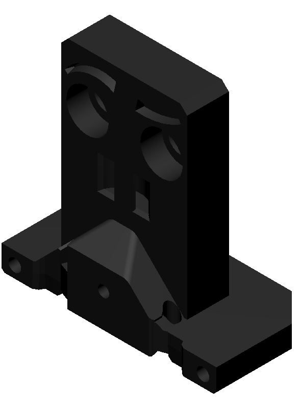
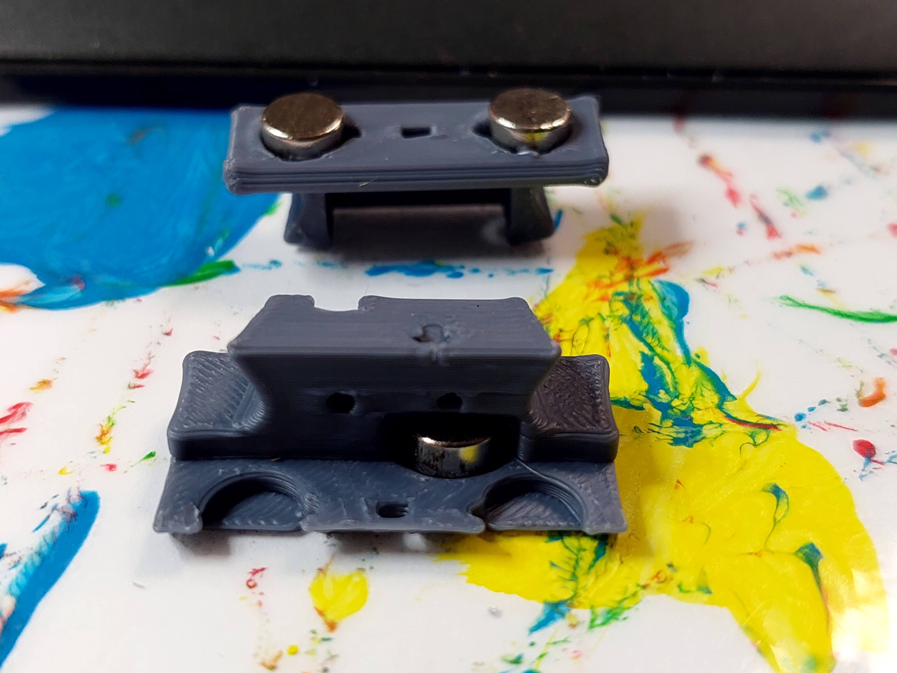
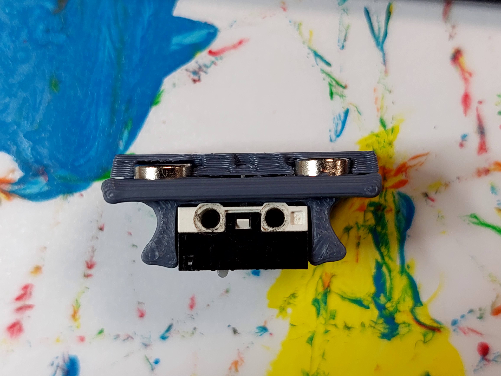
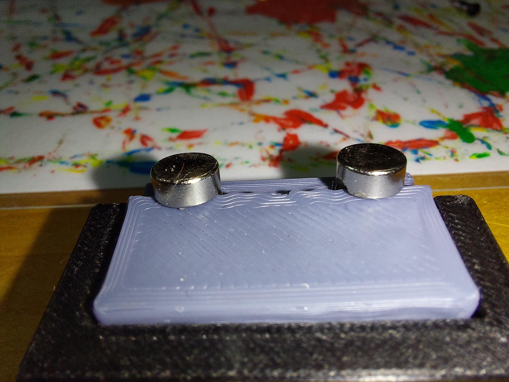
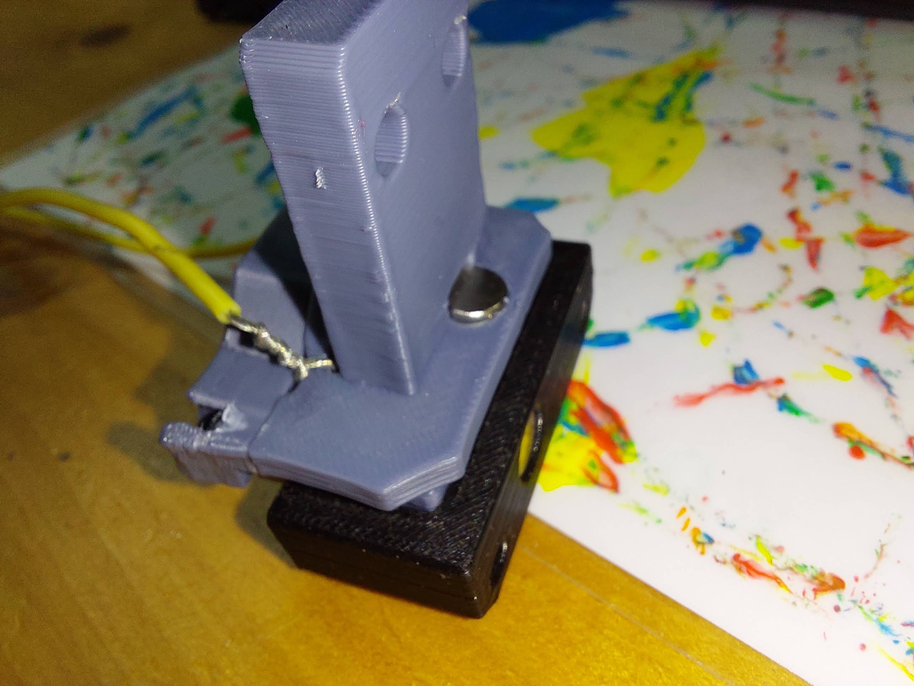

# Klicky Probe NG (Next Generation)
Microswitch probe with magnetic attachment, primarily aimed at CoreXY 3d printers, with enclosed magnets, don't fall, don't need to be glued.

This version is still a **BETA** version, so please use with care.
It's parent version, and still the recommended one is [Klicky](https://github.com/jlas1/Klicky-Probe).

The objectives for this project are:
- drop in replacement for Omron TL-Q5MC2 or PL-08N2 (you don't need to replace the toolhead), replacement of BLtouch probes
- soldering not required
- minimal adjustments required
- be able to detect all the print surfaces
- be as close to the hotend tip as possible
- highly repeatable and accurate probes
- less temperature variations
- no melting of its parts
- reuse spare parts if possible
- no need to use hard to source parts
- no need to glue the magnets

For now this document will only deal with KlickyNG specific wiring, for all the rest of the configuration, please follow the [main guide](https://github.com/jlas1/Klicky-Probe).

The inspiration for the Klicky Probe comes from the [Quickdraw](https://github.com/Annex-Engineering/Quickdraw_Probe) and the [Euclid probe](https://github.com/nionio6915/Euclid_Probe), it uses some concepts from each of the projects, but with this version, it expands on the concept, as the method that it uses was developed independently. 

Please check the main Klicky repository for all the people that helped this project, for NG, would like to thank (in no specific order) Dustinspeed, Drachenkatze, Clee, top_gun_de and whoppingpochard.

If you want to donate something regarding this project, use this [link](https://paypal.me/Josar154) or [__Buy me some ABS!__](https://www.buymeacoffee.com/JosAr), thanks

Without further delay, here is the new version with enclosed magnets:

The eyebrows is Clee/whoppingpochard design.

# KlickyNG support

For now, only printers compatible with Voron StealthBuirner/AfterBurner are compatible, as the NG mount is significantly different.

The CAD with all the files is located [Here](./CAD)
Common KlickyNG STL's are located [here](./STL).

You can also view an exploded view [here](https://youtu.be/mlyU2tHjebo)

## Print Settings

There are no need for supports, recommended settings are 4 perimeters/top/bottom, at least 23% infill, the STL's are already oriented, you only need to send them to the slicer.

## Required parts

|  | If you want to reuse your old Klicky dock, it needs to use this setup of back magnet setup.  It will also be necessary to print the 2mm NG extender, as the dock needs to be 2mm longer |
| :----------------------------------------------------------: | ------------------------------------------------------------ |
|  | Probe Insert, required, it will hold the switch and the two magnets that make the electrical connection |
|  | Probe body, prevents the two front magnets from escaping the probe, holds the third magnet to help attach the probe to the mount and the back magnet to secure it to the dock |
|  | Mount back, mounts to the AB/SB, holds the third magnet and the wire connections |
|  | mount front, there are 2 versions, one for arround 2.75mm (instead of 3mm) long, and one for actual 3mm magnets |

# Bill of Materials (BOM)

- 1x microswitch (the omron D2F-5 or D2F-5L (removing the lever) is recommended), D2F-1 and similar sizes microswitch also work, even the KW10
- 30 cm of wire, can be AWG22 or similar
- 5x M2x10 mm self tapping screws
- 8x 6 mm x 3 mm magnets
- 2x m3 18/20 mm screws

# Build Process

First, assemble the required materials

## Probe assembly

put two magnets on the KlickyNGProbe_v3 Insert, make sure they have the same polarity

Next, insert another magnet on the back groove of the KlickyNGProbe_v3 Body, in this image all 3 magnets should have the same polarity on top, so that when they are assembled, the back magnet will repulse the two front ones

Now, place the insert on the body, aligning the magnets and making sure that the front magnets do not move out of place

insert the switch on it's place (pictured here a KW10)

secure with the two m2x10 screws, it will secure the switch, but also the two parts together

Insert the back magnet and the probe is complete

|  |  |
| ------------------------------------------------ | ------------------------------------------------ |

## AB/SB mount assembly

cut the 30cm of wire in 2 15cm ones, remove 3/4 cm of isolation and rotate the core to prevent loose wires

insert the wire on the holes on the back mount

rotate the wires arround the other end to prevent them from escaping when the mount is being assembled

Put two magnets on top on the probe front magnets

Insert the correct front mount on the magnets so that they remain attracted to the probe.

with the magnets and front secure, joint the mount front and back with an m2 screw

Now complete with the remaining two m2 screws that will keep the front level

attach another magnet on the 3rd probe magnet

Respecting it's polarity, put it into the mount back socket

## 

The mount is now assembled

|  |  |
| ------------------------------------------------ | ------------------------------------------------ |

## Final thouhts

For the installation, you should now change the dock or add the extender and mount the probe mount to AB or SB and test it, you shouldn't need to change any configuration on your printer, if klicky was already running without problems.

I have tested Aliexpress N35, N42 and N45 (graciously provided by Drachenkatze) with over 2000 attach/probe/dock without a single probe or dock operations fail.

Please test and report, but remember, it's a **BETA, it may twist your extrusions, or ruin your print surface, use with care.**

There will also be soon a [Unklicky](https://github.com/majarspeed/Unklicky) for KlickyNG, stay tuned.

It is working very well, if you decide to use it, give me feedback, either here, or on Voron discord, my discord user is JosAr#0517.

By standing on the shoulders of giants, lets see if we can see further.
