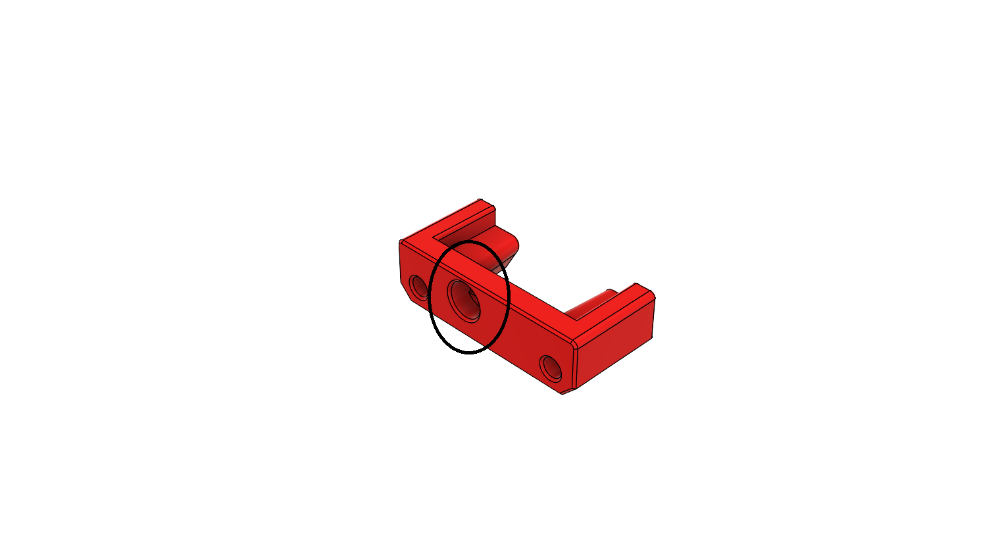
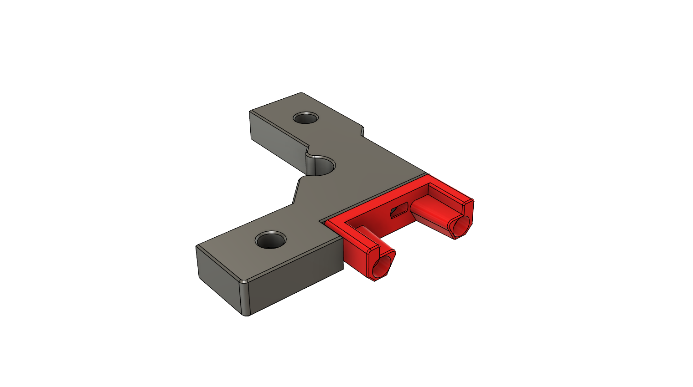
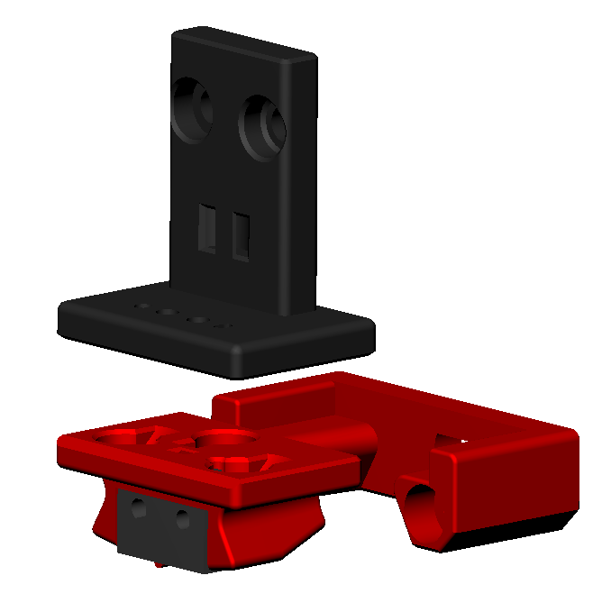
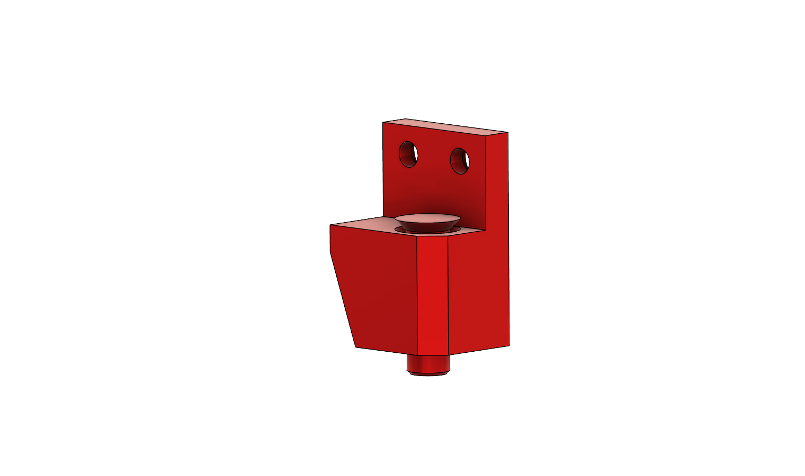
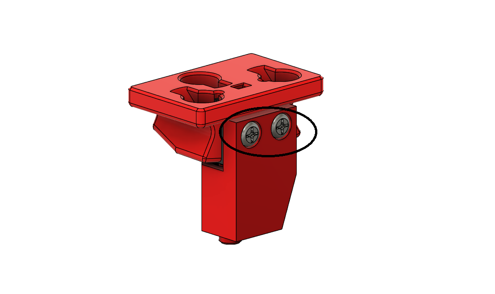
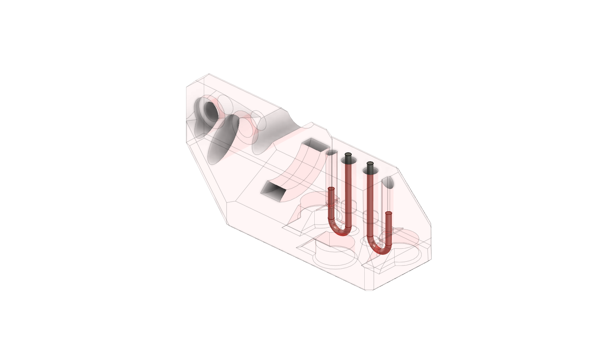
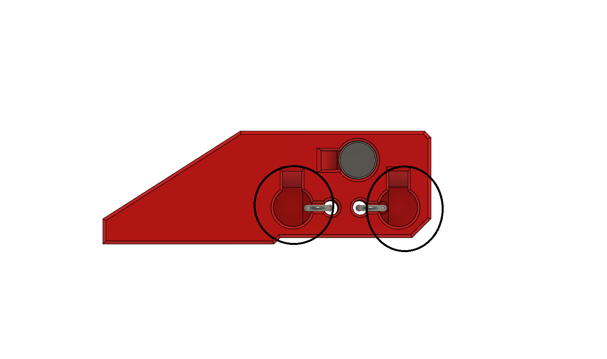
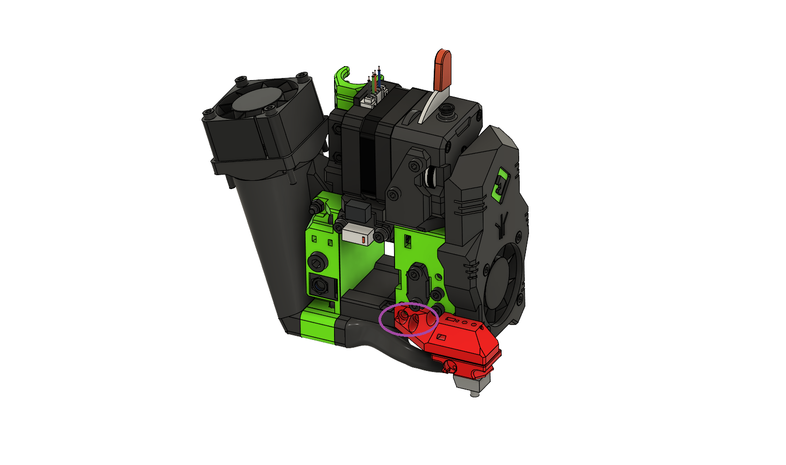

# Klicky Probe for Ratrig VCore3 printers

Here you will find the necessary files and documentation to print and setup your own klicky probe on the VCore3 

This directory has the STL files for printing although it is helpful if you also download and like the [prusaprintables version](https://www.printables.com/model/226368-klicky-and-unklicky-for-vcore3/) as it helps get me some free filament to print more dev parts!

You can find more information about the RatRig printers at the [website](https://www.ratrig.com/) or go check the [discord](https://discord.gg/bxqvFH4UzW). As the main developer of this modification variant for the VCore3 I own a custom shaped VCore3 printer. These parts have however been tested now with quite a few of the standard variations sold by Ratrig.

Due to the fact there is no area on the VCore3 where the dock can be fully outside the footprint of the print bed you will lose a small amount of print volume in the very front left corner.

Above all, have fun and be excellent to one another, now on to the instructions.


# BOM
DISCLAIMER: I use affiliate links in my BOM and in many product links on my site. These links help generate revenue so that I can keep my content both add free and at zero cost to you!

- 2 x M3*16mm [Aliexpress](https://s.click.aliexpress.com/e/_De4xA9Z)
- 2 x M2*10mm self tapping screws [Aliexpress](https://s.click.aliexpress.com/e/_DmxbgMn)
- 2 x M3 x D4.6 x L4.0 heat set inserts [Aliexpress](https://s.click.aliexpress.com/e/_Ddrgszh)
- 7 x 6*3mm magnets [Aliexpress](https://s.click.aliexpress.com/e/_DD4HIvp)
- 1 x D2F switch [Aliexpress](https://s.click.aliexpress.com/e/_DCo538T)
- 24AWG wire [Aliexpress](https://s.click.aliexpress.com/e/_DkDpExV)

If you are in a hurry or want local suppliers, you can [check this list of suppliers](https://github.com/jlas1/Klicky-Probe/blob/main/Sourcing.md).

# Printed parts
The parts have been released on [Printables](https://www.printables.com/model/226368-klicky-and-unklicky-for-vcore3/) and also locally [here](./VCore3_STL).

The Dock and probe depend on the one you select below and can be retrieved from the build instructions below.

Print everything except the piston probe body and piston with 0.2mm layer height using a 0.4mm nozzle. Recommend 4 walls, 4 top/bottom layers and 40% infill. 

For the piston probe body and piston print them with the same settings but at 0.1mm layer height. You may also want to add a scaled up and down piston (by 1-2%) in addition to the provided size as the fit is important. Suggested orientation is shown below.


For EVA3:

- 1 x VCore3 Klicky mount
- 1 x EVA3 klicky probe arm
- 1 x Klicky probe
- 1 x Piston Klicky Body
- 1 x Piston Klicky pin
- 1 x Klicky probe dock v2

For EVA2:

- 1 x VCore3 Klicky mount
- 1 x EVA2 klicky probe arm
- 1 x Klicky probe
- 1 x Piston Klicky Body
- 1 x Piston Klicky pin
- 1 x Klicky probe dock v2

# Compatibility
I have tried my hardest to design this mod to be compatible with as many popular combinations as possible. This work has been extended further by Arlock.

## VCore3

- Standard frame
- OpenFront mod
- Official enclosure

## EVA3

- All configurations except the tank shroud

## EVA2
- All configurations
- Not compatible with the top MFBS mods. Please see the mod [Arlock has released](https://www.printables.com/model/222832-klickyunklicky-dock-for-vcore-3-integrated-into-mf) that adds compatibility with that ecosystem.

# Setup process
Either watch the [youtube assembly video](https://youtu.be/YpNB8FlAlf0) below or scroll further down for a step by step written description of the process.

## Assembling the dock
Press a magnet into this hole on the dock. No glue is required as it will be captive inside the assembly (useful for if you need to upgrade in the future!). The orientation doesn’t matter at this stage as we will set the orientation of the one in the probe based on this.



Next bolt the probe dock to the mounting bracket using two M3x18mm bolts. Make sure it is oriented as shown with the magnet on the right hand side and the countersinks on the mounting bracket facing down.



The new dock has been designed to locate accurately off of the existing frame. It fits in the front left corner underneath the idler plate. Carefully remove the two bolts circled in red. You want to avoid knocking the T nuts out of place so when you replace with a long bolt they are in the right spot for it to catch and do back up.


The dock will only fit one way round due to the cutout for the idler bolt. Push the dock firmly into the corner, add the bolts and tighten up.

## Assembling the probe 

klicky probe, based on the [Quickdraw probe](https://github.com/Annex-Engineering/Quickdraw_Probe), with an added third magnet for added stability and fixed dock gantry setups.



It uses magnets to secure the probe to the mount and also to make the electrical connection.
The magnets can be glued to prevent them from coming loose.
It supports a [microswitch probe](../../../Probes/KlickyProbe/) and [Unklicky](../../../Probes/UnklickyProbe/) (for Vcore, you need the BFP Unklicky_XL_body.stl) ([invented by DustinSpeed](https://github.com/majarspeed/Unklicky)) (self built probe, that so far surpasses the microswitches in common use) based probing.

There is a [new version (KlickyNG)](../../../Probes/KlickyNG/) that will be compatible with Vcore soon.

## Assembling Klicky piston probe

Install the printed piston into the piston housing. Run it back and forth a few times until it is running smoothly. If it is too tight scale the print down a little and try again. We will run 500 probes to bed the probe in but it needs to be reasonably close from the start.



Attach the piston housing to the probe body using the two m2 self tapping screws, you may need to remove them if already installed. The piston will compress the switch very slightly when assembled but should not activate it until you press on it. This will also hold the switch in place for the next few steps of adding the remaining magnets.



Once finished your probe assembly should look like this. Check that the piston when pressed causes the switch to click and then again as you release. Now is the time to use a multimeter and check you get continuity between the two magnets circled above. You should be able to note the continuity being made and broken when you actuate the switch. This ensures the probe is assembled and working.


## Assembling the probe arm
Start by feeding two 22AWG wires through the holes at the top. Strip a 10mm length of insulation off of each one. Twist the ends and then feed them back up through the holes at the edges of the magnet cutouts. Once done I like to add a 2pole connector such as a JST SM inline connector so that it can be removed or swapped without messing with your entire print head wiring loom.



Add a small drop of superglue to the central magnet hole. This magnet needs to be oriented such that the central magnet on the probe side will be attracted to it. Use the magnet assembly helpers or a flat surface to insure they sit flat.


IMPORTANT – Wait for the glue to dry. It is really really easy to accidentally pull the magnet back out while you add the next two in.

Install the other 2 magnets using the same method. These should have the opposite polarity to the central one.



Once completed your probe arm should look similar to this. The magnets will be slightly proud of the surface and should be level.


Install the probe arm onto the EVA carriage in the standard probe location and using the standard M3 bolts.



# Wiring
The klicky probe should be wired into the BLTouch port on your controller board. I won’t add wiring diagrams here because there are so many boards being used out there. One wire should be connected to the probe pin and the other to ground. It doesn’t matter which way round as there is no fancy electronics in the switch 🙂.

# Configuring RatOS for Klicky
If you installed Klicky before then you will be familiar with the standard set of Klicky macros. These can still be configured to be used with this docking system but many users found this hard to achieve and writing a guide that was able to take into account everyone’s unique setups was difficult! Miklschmidt has been working some magic in the background and there is now a development branch of RatOS that supports stowable probes out of the box. In parallel I’ve provided the configuration for the Klicky probe setup above.

In the near future you will be able to configure your setup for the Klicky probe with just a single line change in the printer.cfg but unfortunately we are not quite there yet. As the branch is still in development there are some changes you need to do to switch over. You can test it out right now though! (And it’s still easier than setting up Klicky the old way!)

WARNING: If you follow the changes below you will be switching to the DEVELOPMENT branch for RatOS. This branch is evolving constantly and has not been tested fully for release. Whilst it was stable at the time of writing this I can’t promise it will always be stable. You will need to swap back once the dev branch gets merged but you shouldn’t have to change your printer config again.

SSH into your printers raspberry pi and swap to the development branch.

```
ssh pi@ratos.local
cd ~/klipper_config/config
git fetch origin
git checkout development
```
Update your moonraker.conf to include the two lines relating to the dev branch. (It’s best to include comments so you can easily remember which bits to remove at a later date!)

```
[update_manager client RatOS]
type: git_repo
path: /home/pi/klipper_config/config
origin: <https://github.com/Rat-OS/RatOS-configuration.git>
install_script: /home/pi/klipper_config/config/scripts/ratos-install.sh
# Dev branch
primary_branch: development
```
Now is the big step. The development branch requires a newly configured printer.cfg as quite a lot has changed in the background. It’s not hard to do but I advise you take the opportunity to download and save your current one in case something goes wrong and your need to backtrack. Once you have a backup saved navigate to /config/config/templates and open v-core-3-printer.template.cfg. Copy all the text from there. Navigate back to your printer.cfg. Select all the text and delete it. Then paste in the new config.

Configure the new file as per your physical setup. Use the old config as a reference. Make sure to copy over your user overides (unless they relate to the probe usage). Lastly to enable Klicky simply uncomment the lines in the homing section as per the code block below

```
#############################################################################################################
### HOMING
### Pick your probe and endstops
#############################################################################################################
# BL Touch
#[include config/z-probe/bltouch.cfg]
 
# Inductive/Capacitive probe
#[include config/z-probe/probe.cfg]
 
# Euclid probe (please read the RatOS documentation for instructions)
#[include config/z-probe/euclid.cfg]
 
# Klicky probe (please read the RatOS documentation for instructions)
[include config/z-probe/klicky/klicky.cfg]
#[include config/z-probe/klicky/unklicky.cfg] 
 
# Physical endstops
[include config/printers/v-core-3/physical-endstops.cfg]
 
# Sensorless homing (Beware: this requires manual tinkering and does not work if your x/y stepper drivers 
# have clipped DIAG pins). It is strongly encouraged to use physical endstops if you're a beginner. 
# If you still wish to proceed, copy config/templates/sensorless-homing-tmc2209.cfg to the root directory and 
# remove the # from the line below. 
#[include sensorless-homing-tmc2209.cfg]
```

You should be ready to commission the probe now!

# Commissioning the probe
WARNING: Make sure you follow the next few steps before doing anything else. These steps should help check that the dock location and your end stops are all in right place for the probe docking procedure to work smoothly and not cause crashes.

WARNING: make sure you bed is pretty close to level by eye before trying a new probe there is always a risk that if the bed has too greater angle you will crash the nozzle or probe into it.

- Home XY axis (DO NOT HOME ALL or Z!)
- Move printhead to X13.0 Y6.5
- Check that the probe arm sits perfectly over the probe/dock
- If it doesn’t adjust your X or Y endstop slightly in the direction needed.
- Repeat steps 1-4 until happy
- From X13.0 Y6.5 move your printhead about 60mm in positive X. The probe should - smoothly come out of the dock.
- Move the printhead back to X13 Y6.5. the probe should smoothly move into the dock
- Move the printhead by about 60mm in the positive y direction. The probe should - slide off the probe arm and stay seated in the dock.
- Try running DEPLOY_PROBE and STOW_PROBE (these are RatOS stowable probe macros). the probe should smoothly dock and undock. If it doesn’t you may need to go back and repeat steps 1-8.
- Deploy the probe and move it to the centre of the bed. Run the command below to do 500 probe cycles. This will help bed in the piston section and give you more reliable results going forwards
```PROBE_ACCURACY samples=500```

If you got through all the steps above without issue then you are good go! Enjoy the Klicky life!

# Reverting back to master RatOS branch
SSH into the pi and run the following commands to swap back to the Master branch

```
ssh pi@ratos.local
cd ~/klipper_config/config
git fetch origin
git checkout master
```
Comment out the primary branch line in your moonraker.conf

```
[update_manager client RatOS]
type: git_repo
path: /home/pi/klipper_config/config
origin: <https://github.com/Rat-OS/RatOS-configuration.git>
install_script: /home/pi/klipper_config/config/scripts/ratos-install.sh
# Dev branch
#primary_branch: development
```

NOTE: if the reason you are doing this isn’t because the changes on development branch have been merged into master then you will also need to do the next step.

Replace your printer.cfg with the backup you stored at the start of the firmware section.

For help using or installing Klicky take a look at the guides posted on my blog [3DPandME](https://www.3dpandme.com/) or join the [discord](https://discord.gg/kKj9epxn7B) 

By standing on the shoulders of giants, lets see if we can see further.
