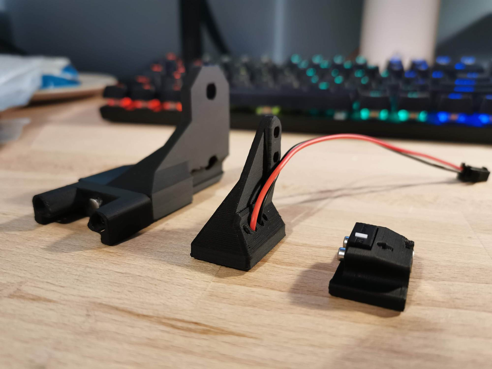
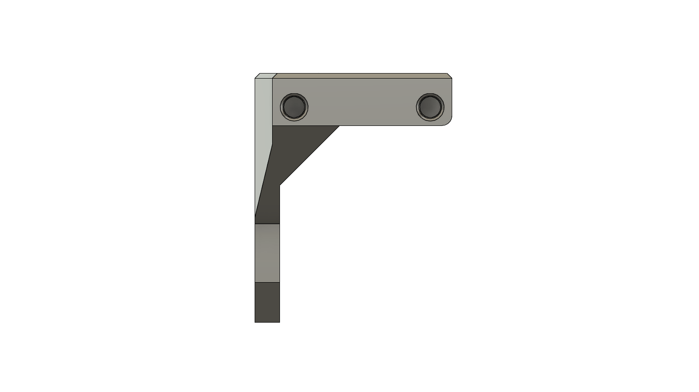
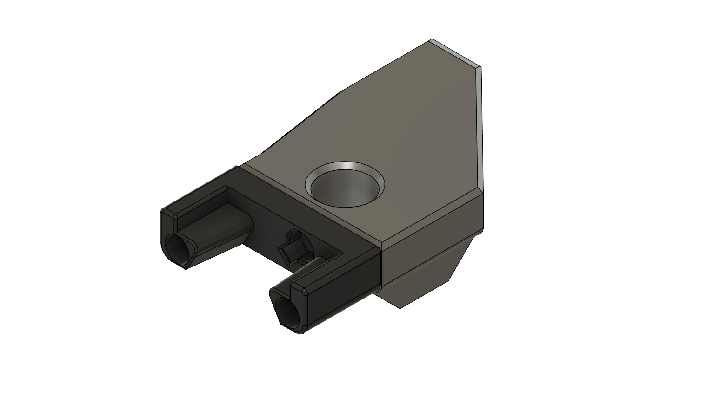

# Klicky Probe for Ratrig VCore3 printers

Here you will find the necessary files and documentation to print and setup your own klicky probe on the VCore3 

This directory has the STL files properly oriented for printing and community mods for the respective printer, there are [klipper](../../../Klipper_macros) macros and [RRF](../../../RRF_macros) macros on the repository.

You can find more information about the RatRig printers at the [website](https://www.ratrig.com/) or go check the [discord](https://discord.gg/bxqvFH4UzW). As the main developer of this modification variant for the VCore3 I own a custom shaped VCore3 printer. These parts have however been tested now with quite a few of the standard variations sold by Ratrig.

Due to the fact there is no area on the VCore3 where the dock can be fully outside the footprint of the print bed you will lose a small amount of print volume in the very front left corner... Note the default profile uses this area for the purge line anyway and this does not need to be modified as the direction of the purge line ensure the probe is not picked up.

Above all, have fun and be excellent to one another, now to the instructions.


## Mounting

### Probe dock mount

The probe dock is mounted to the front left extrusion, depending on your leadscrew length some of it may poke through the hole in the bracket

### Probe toolhead mount

The probe toolhead mount has been designed to be directly compatable with the EVA system and bolts onto the probe mounting holes. (Note it does however have a different probe offset to the standard bl touch and inductive probes)

## Bill of Materials (BOM)

### Tools:

- 1.5mm Drill (optional)
- Multimeter to check for Continuity 
- Super Glue (optional but advised)
- Soldering Iron

### Probe:

- 1x microswitch (the omron D2F-5 or D2F-5L (removing the lever is required), other also work with reduced accuracy or repeatability (mostly anecdotal evidence, needs a proper sudy)
- 2x M2x10 mm self tapping
- 10cm of 22AWG cable (to wire the magnets to the switch)
- 5x 6 mm x 3 mm magnets (N35 magnets work)

### Probe mount:

- 4x 6 mm x 3 mm magnets (N35 magnets work)
- 2x 22AWG cable (to connect the Klicky Probe to the control board)
- 2x M3x6 mm BHSC Screw

### Probe dock:

- 1x 6 mm x 3 mm magnets (N35 magnets work)
- 2x M3x16 mm

### Probe dock mounts:

- 2x M6x12 cap head bolt
- 2x M3 threaded insert M3x5 mmx4 mm

## Sourcing

To get the best experience, please consider purchasing from the trusted list of suppliers bellow.

[trusted suppliers list](./Sourcing.md)

## Parts location

The probe STL's are located [here](../../../Base_STL).

The printer specific STL's are located [here](./VCore3_STL).

## What to print

- 2x KlickyProbe_v2.stl (keeping a spare is always a good idea)
- Probe_Mount_v1.stl
- Probe_Dock_v2.stl
- Probe_Dock_Mount_v1.stl



#### Helpers to pressfit the probe magnet

- Probe_magnet_pressfit_helper.st
- Probe_magnet_holder.stl
- probe_pressfit_helper.stl

### Printing instructions

Recommended printing settings:

* initial layer height:0,24
* layer height: 0.2mm
* bottom/top/perimeters: 4
* infill: more than 23%
* infill type: Cubic
* Thin walls: On

It was tested and printed with ABS and PETG, might work on other materials, if you try, let me know how it worked out.

## Assembly

### Step 1 - Dock mount and Probe Dock assembly 

- [ ] 2x M3 threaded insert M3x5 mmx 4 mm
- [ ] 1x 6 mm x 3 mm magnets
- [ ] 2x M3x16 mm
- [ ] Super Glue

Install your heat set threaded inserts in the holes shown below.



Install the magnet in the Probe dock, make sure that the magnet is fully inserted, it's top should be below the plastic.

Screw the dock onto the Dock mount with the two M3x16mm screws.

Secure the magnet with a dab of super glue (not a lot, just a drop).



Mount the Probe Dock to the front left extrusion, You will adjust the Z offset in a minute.


### Step 2: Probe Assembly

For the probe assembly you need the following parts:

- [ ] 1x microswitch
- [ ] 2x M2x10 mm self tapping
- [ ] 5x 6 mm x 3 mm magnets
- [ ] 22AWG cable
- [ ] 1.5mm Drill (optional)
- [ ] Multimeter to check for Continuity 
- [ ] Super Glue


Maybe you need to clear the holes for the microswitch, a 1.5mm drill bit should work fine.

Install the microswitch so that the arrow on the probe body is pointing to the little switch.

The best way to install the back magnet is to attach a magnet to the probe dock and slide the probe on the dock to insert some distance and the insert he remaining with a tool, it should be slightly below the plastic.


Then take your self tapping screws and screw the microswitch in place, you should also now solder the wires to the outside pins of the switch, that way making this a Normally Connected probe.


You want to install the magnets in the way that the ones which are connected to the microswitch, have the same polarity.

Before placing the switch magnets, use some super glue on the holes (not a lot, just a drop), avoid the wires and the top of the magnets.

The 3rd magnet should have the inverse polarity, wait until the system is complete and assembled before gluing the magnets, they might need adjustment to ensure a good fit on the mount.

You can use the included pressfit helpers to help in securing the probe when you are inserting the magnets.


There is no need for soldering, the probe microswitch connectors are press-fit on the magnets, they should remain with the top above the probe plastic.


As the last step of the probe assembly check if you have continuity between two magnets that connect to the switch.

If you have a normally closed switch (as you should), then you should have a current flow, so continuity is established. When you press the switch you should lose continuity. When you have a normally open switch then the behavior is the other way around.

### Step 3: Probe mount Assembly

For the probe mount assembly you need the following parts

- [ ] 3x 6 mm x 3 mm magnets
- [ ] 22AWG cable to connect the Klicky Probe
- [ ] 2x M3 x 12mm BHSC 
- [ ] Multimeter to check for Continuity 
- [ ] Super Glue

The probe mount wires are also connected with pressure from the magnets, you can use the probe magnets as a template to insert the probe mount magnets, it is easier that way, so that the magnets are not inserted the wrong way.


again, before placing the wire magnets, use some super glue on the holes (not a lot, just a drop), avoid the wires and the top of the magnets.

The 3rd magnet should have the inverse polarity, exacly like on the probe.

Wait until the system is complete and assembled before gluing the 3rd magnets, they might need adjustment to ensure a good fit on the probe.

After everything is assembled let's check again for continuity, this time joining the ends of the cable and testing connectivity on the two wire magnets that have a cable.

### Step 4: Probe Mount installation and wiring

For the installation you need the following parts:

- [ ] 2x M3x12 mm BHSC Screws


Route the probe mount cables between the probe mount and the fan duct and then up the side of the EVA backplate. When installing the mount be careful not to push the hex nuts out of their grooves. It is a pain to take apart the EVA assembly to put them back in.

**Before going further, please turn off the printer, the boards are very picky with short circuits.**

Connect the probe to the controller board. You may also put an inline connector (I chose to do this) to enable easier switching in the future.

When testing the docking and attachment of the probe, make sure that the back magnet of the probe and the dock magnet do not touch, if they do, it will make attaching the probe much harder.

### Step 5: klipper configuration

As of right now, klipper and RRF have no inbuilt support for a removable probe, fortunately, it does support very robust macro programming, so you will need to add macros to be able to dock and attach the probe as necessary, as well as supporting the rest of the functions that require the usage of a probe.

The macros and instructions on how to configure are located on the [Macro directory](../../../Klipper_macros), you need to **check that before continuing on the build**, there are also some [RRF scripts](../../RRF_macros) that work.

This guide will assume users are using RATOS for their printer. It is probably easier to follow the generic Voron installation instructions if using a standard klipper installation.

Add all the klicky macros to the config directory (same level as your printer.cfg file.)

Update printer.cfg with the following changes:

Add the include line for the klicky probe

```python
#############################################################################################################
### HOMING
### Pick your probe and endstops
#############################################################################################################
# BL Touch
#[include config/z-probe/bltouch.cfg]
# Inductive/Capacitive probe
[include config/z-probe/probe.cfg]
[include klicky-probe.cfg]
```

Comment out the bltouch line if using and uncomment the probe line. Add line specifying that the probe is now connector to the z endstop pin (check your boards pinout to get the pin number). Comment out the whole safe z homing section

```python
# Z Probe configuration
#[bltouch]
#z_offset: 0.0 # Adjust this to fit your setup
[probe]
#z_offset: 0.0 # Adjust this to fit your setup
pin=PG10 # Added because using Z endstop pin as probe pin
#pin: ^probe_pin # For NPN NC probes such as the Super Pinda / Vinda / SupCR / Decoprobe probes.
#pin: ^!probe_pin # NPN NO (refer to the specs on your probe)
#pin: probe_pin # PNP NO (refer to the specs on your probe)
#pin: !probe_pin # PNP NC (refer to the specs on your probe)

# Safe Z Home (Physical endstops only)
#[safe_z_home]
#home_xy_position: 150,150 # 300mm printer
#home_xy_position: 200,200 # 400mm printer
#home_xy_position: 250,250 # 500mm printer
```
In the user overides section add the following section.

```python
[probe]
x_offset: -24.526
y_offset: -20.725
```


#### Assembled Klicky Probe

See assembled probe in action on youtube [here](https://youtu.be/aWnHNNrViP0)


### Step 6: klipper  Dock/Undock  configuration

#### Adjust Probe Pickup Position

One of the last things we need to do is to adjust the probe pickup position. I suggested manually moving the print head into position and use that to set your probe dock mount z height on the extrusion.

Turn your printer on and then make sure that the x and y axis are homed and the probe is manually attached to mount.

Now manually (with gcode commands) move the toolhead to the probe dock and move it so far to the back that the probe docks, note the Y-Position.

Next, again manually, move the toolhead parallel to the probe dock until the probe it is perfectly aligned with the mount, note the X.Position.

Open your `klicky-variables.cfg` and find the `#dock location` section and edit the following two line

```python
variable_docklocation_x:
variable_docklocation_y:
```

Test now with the ATTACH_PROBE and DOCK_PROBE if it docks and is removed correctly, some common points that can give problems are:

* the dock magnet is touching the back probe magnet, they cannot touch, push them further in
* the probe is hitting the dock arms, please move the toolhead more to the side where the probe does not hit, by 1mm at a time, until it works
* the probe is falling after being release, the dock is too far away, you can insert one or several 1mm spacer to move the dock and solve this

***WARNING when you are doing PROBE_ACCURACY, make sure that the probe is above the bed, the PROBE_ACCURACY macro does not move the toolhead in X or Y.***

Congratulations, your done :).

## Firsts tests

Before starting to test klicky, and from past mistakes, please remove your PEI sheet (the probe works on the magnetic sheet) and if possible, change your printer maximum speed, acceleration and Z current, on klipper with TMC steppers, you can do this:

```python
SET_TMC_CURRENT STEPPER=stepper_z CURRENT=0.2 
SET_VELOCITY_LIMIT ACCEL=1000
SET_VELOCITY_LIMIT VELOCITY=50
```

Enjoy your Klicky Probe!


## Dock and undock video

https://youtu.be/qqRuQJcBS7o

It is working very well, if you decide to use it, give me feedback, either here, or on discord, my discord user is Slzer#2881. Also a massive shoutout to JosAr#0517 who create the Klicky, all I did was modify it for the VCore3.

For help using or installing Klicky take a look at the guides posted on my blog [3DPandME](https://www.3dpandme.com/) or join the [discord](https://discord.gg/kKj9epxn7B) 

By standing on the shoulders of giants, lets see if we can see further.
