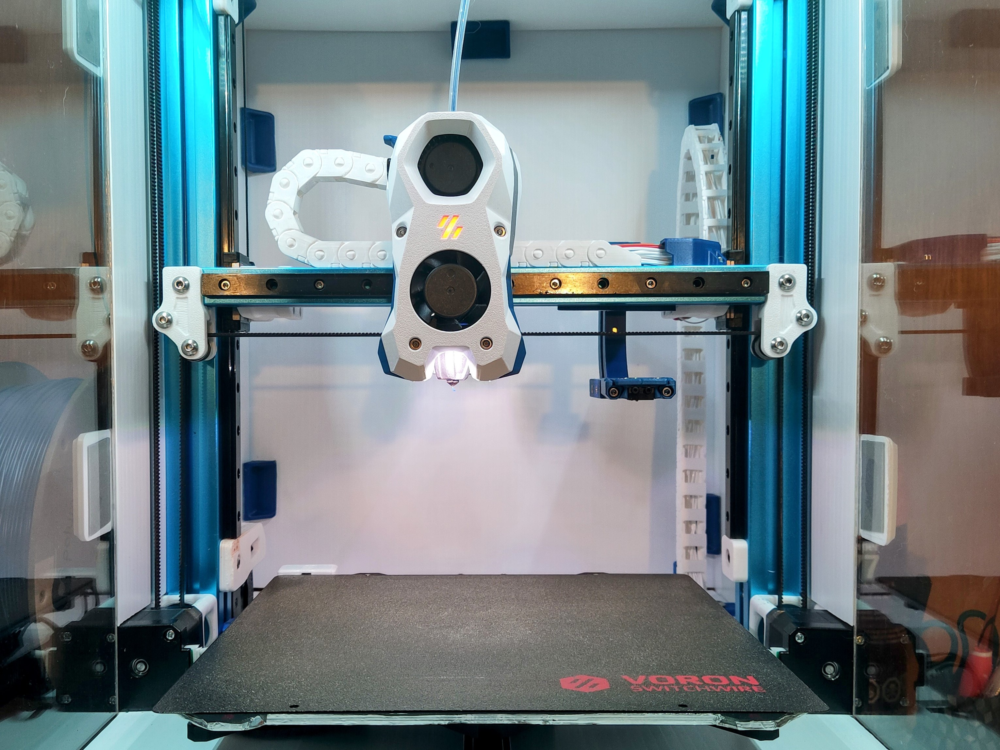
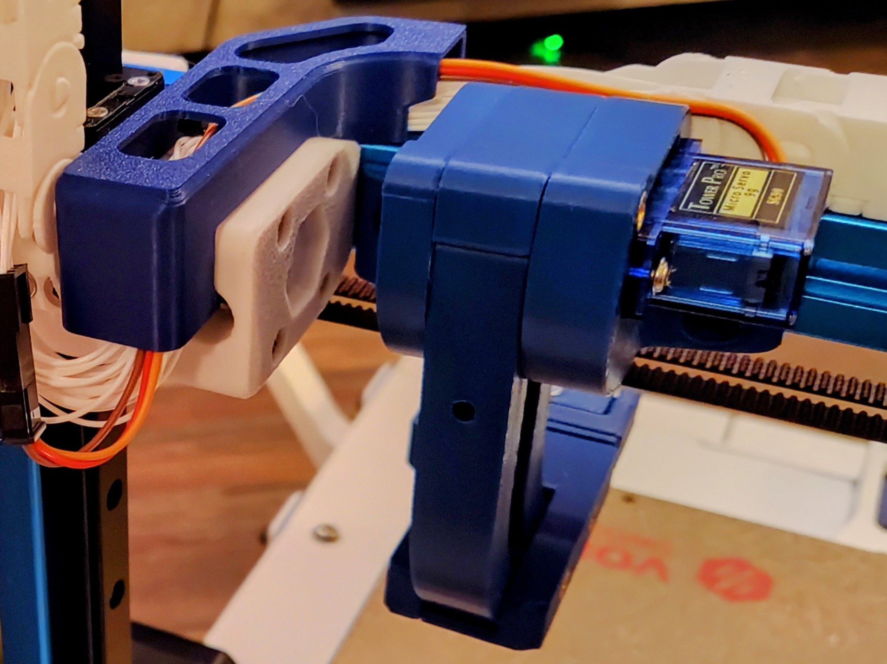
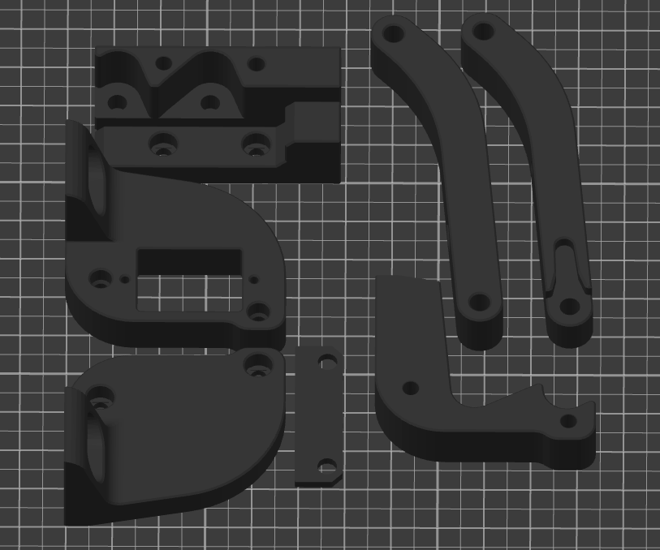
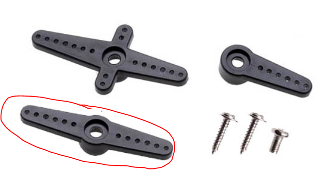
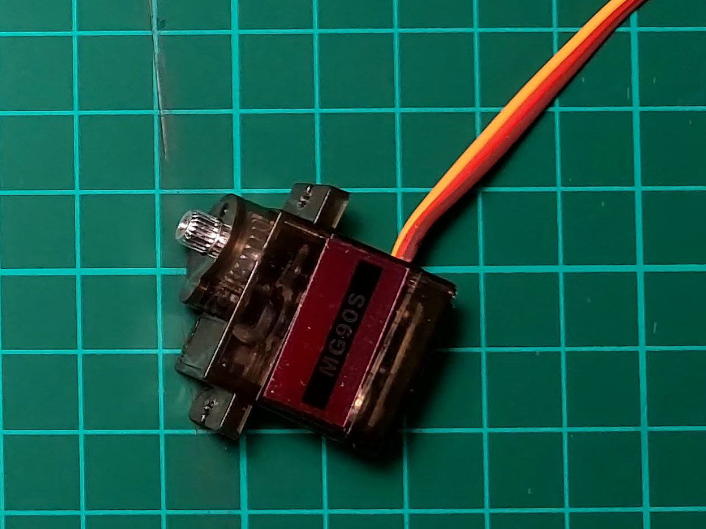
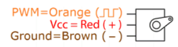
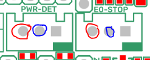
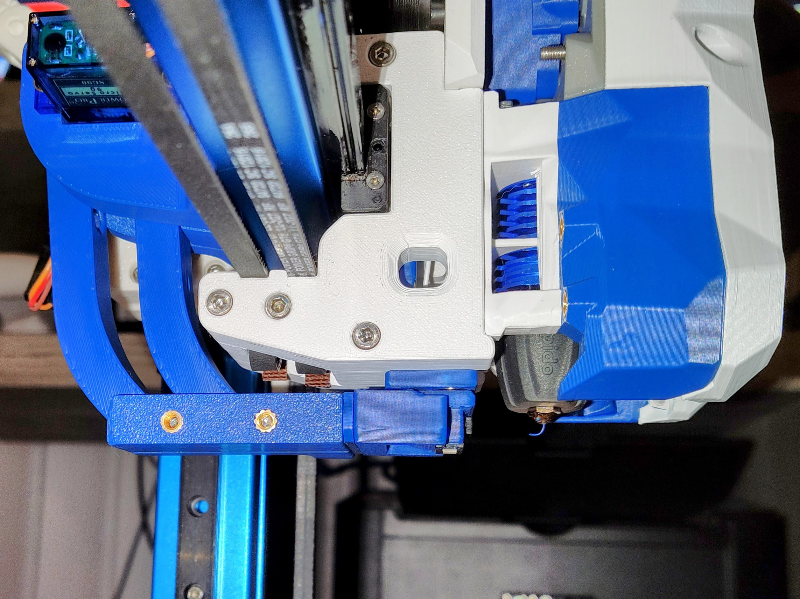
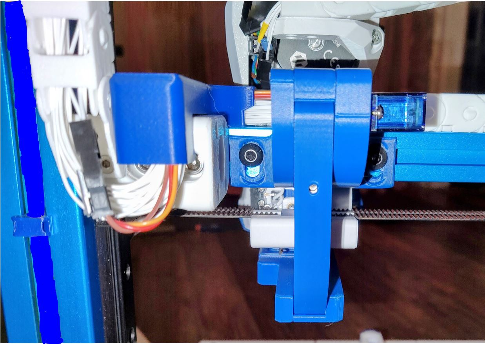

# Klicky Probe for  Vorondesign Switchwire printers

Here you will find the necessary files and documentation to print and setup your own klicky probe on the Switchwire (finally).



It uses a slightly different approach than most magnetically attached probes, it's secured on the X extrusion, so it's available on any Z height and can be used without knowing the Z position, just like all the others.

I do not own a  Switchwire, so the tests were made with the help of the Voron community to whom i would like to thanks for the support, first and foremost to Patrice who was an excelent contributor to the project and main instigator, and also marciorssilva, Iconic FAB lv and Jason who tested and troubleshooted several components.

This directory has the STL files properly oriented for printing and community mods for the respective printer, there are [klipper](../../../Klipper_macros) macros and [RRF](../../../RRF_macros) macros on the repository.

You can find more information about the Voron printers at the [website](https://vorondesign.com/) or go check the [discord](https://discord.gg/voron), for the record, i own a v2.4, this is how i would describe them "A Voron is a fast high quality printer, i print with much better quality  the perimeters at the draft speed of my old bedslinger. It also has a  big community with lots of documentation and new ideas."

It has a servo powered dock on the X axis, the bed can be fully used during printing, and it can also be used without extra configurations as a virtual Z endstop.

Above all, have fun and be excellent to one another, now to the instructions.

This mod is not yet on [VoronUsers repository](https://github.com/VoronDesign/VoronUsers/tree/master/printer_mods/JosAr/Klicky-Probe), should be soon. 

They say an image is worth a 1000 words, but this is better described by a [small movie](https://youtu.be/if7qnrqHi_w), this was filmed by Patrice.

Some picture before heading to bussiness.

|  |  |
| ------------------------------------------------------------ | ------------------------------------------------------------ |


## Probe selection

Right now, there are two probe attachment options, each with two probe types.

### [Regular Klicky](../../../Probes/KlickyProbe/)

First klicky probe, based on the [Quickdraw probe](https://github.com/Annex-Engineering/Quickdraw_Probe), with an added third magnet for added stability and fixed dock gantry setups.


It uses magnets to secure the probe to the mount and also to make the electrical connection.
The magnets can be glued to prevent them from coming loose.
It supports a microswitch probe and Unklicky ([invented by DustinSpeed](https://github.com/majarspeed/Unklicky)) (self built probe, that so far surpasses the microswitches in common use) based probing.

To assemble this probe, choose one and head to the assembly instruction below, the probe BOM is also there:

- [KlickyProbe](../../../Probes/KlickyProbe/)
- [Unklicky original (coiled wire variant, uses one 3x2 magnet)](https://github.com/majarspeed/Unklicky/tree/main/Unklicky)
- [Unklicky BFP-HS (heat set version, uses only 6x3 magnets)](https://github.com/majarspeed/Unklicky/tree/main/BFP-HS), should be more resilient over time
- [Unklicky BFP (coiled wire variant, uses only 6x3 magnets)](../../../Probes/Unklicky/)

### [KlickyNG](../../../Probes/KlickyNG/)

New enclosed magnets probe, it does not require glue to help prevent the magnets from coming loose, magnets are also self aligning.
This approach only uses common and easy to source parts.


Also supports a microswitch probe and Unklicky ([invented by DustinSpeed](https://github.com/majarspeed/Unklicky)) (self built probe, that so far surpasses the microswitches in common use) based probing.

To assemble this probe, choose one and head to the assembly instruction below, the probe BOM is also there:

- [KlickyNG Probe](../../../Probes/KlickyNG/)
- [UnklickyNG original (coiled wire variant, uses two 3x2 (or 3x4) magnets)](../../../Probes/UnklickyNG/)
- [UnklickyNG BFP (coiled wire variant, uses only 6x3 magnets)](../../../Probes/UnklickyNG/)

## Bill of Materials (BOM)

### Tools:

- Multimeter to check for Continuity 
- Super Glue (optional)
- Soldering Iron to install the heat inserts

### Probe:

- check the links on the probe section above

### AB/SB mount:

- check the links on the probe section above

### Probe dock:

- check the links on the probe section above

### Servo mount

- 2x M3x24 mm SHC Screws
- 3x 1m 24AWG cable to connect the servo 
- 2x  threaded insert M3x5 mmx4 mm
- 2x M5x10 BHCS
- 2x M5 T-Nut for 2020 extrusion
- 1x MG90s servo with arms and mounting screws included

### Arms

- 4x 6 mm x 3 mm magnets (N35 recommended)
- 3x20 mm PTFE Tube (4mm OD 2mm ID) 
- 1x12 mm PTFE Tube (4mm OD 2mm ID) 

### Dock mount:

- 2x M3x20 mm SHC Screws
- 4x  threaded insert M3x5 mmx4 mm

## Sourcing

To get the best experience, please consider purchasing from the trusted list of suppliers bellow.

[trusted suppliers list](../../../Sourcing.md)

## Parts location

The probe STL's are located on each probe directory on the STL

The printer specific STL's are located [here](./SW_STL).

The CAD with all the parts are [here](../../../CAD).

## What to print

### Probe

follow the instructions on the Probe selection section

### AB/SB mount

follow the instructions on the Probe selection section

### Probe dock

follow the instructions on the Probe selection section

### Servo mount

- Servo_Mount_Body_right
- Servo_Mount_Body_center
- Servo_Mount_Body_left

### Arms 

- Drive_arm_front
- Drive_arm_back

### Dock mount

- Servo_dock_mount_right
- Servo_dock_mount_left
- 2x 2mm_extender (might be required)

### Printing instructions

Recommended printing settings:

* initial layer height:0,24
* layer height: 0.2mm
* bottom/top/perimeters: 4
* infill: more than 23%
* infill type: Cubic
* Thin walls: On

The recommended printing orientation is (the STL's are correctly oriented for printing):



It was tested and printed with ABS, might work on other materials, if you try, let me know how it worked out.

### Components


## Assembly

### Step 1 - Servo arm preparation

Find the servo arm that fits the dock arm the best and cut off anything else on that arm if there is anything, tipically is the one that is circled.




### Step 2 - Arms preparation

Insert 2 6x3 magnets on each arm socket.


Also insert the 3 20mm PTFE tubes and the 12 mm one on the arms as displayed on the picture:


### Step 3 - Dock mount

With the soldering iron tip, heat set the 4 threaded inserts like you did within your Voron build on the dock mount body, two on the top of each body and two on the side of the Servo_dock_mount_left:

|  |  |
| -----------------------------------------------------------: | :----------------------------------------------------------- |


Now attach the arms with the 20mm PTFE tube on the Servo_dock_mount_left part, take care to match the arms positions as they are on the image:


Complete assembly by attaching the Servo_dock_mount_right and secure with 2x20 mm m3 screws  :


### Step 4 - Servo mount

With the soldering iron tip, heat set the 2 threaded inserts like you did within your Voron build on the Servo_mount_body_left.


Now attach the arms with the 20mm PTFE tube on the Servo_mount_body_right part, take care to match the arms positions as they are on the image:


Insert the Servo_Mount_Body_center following the body contour:


And complete assembly by attaching the Servo_Mount_Body_left and secure with 2x24 mm m3 screws:


### Step 5 - Probe Dock assembly

Now attach the probe dock assembly that you want to use to the Dock arm with 2x16mm m3 screws.


Note: you may need to use later a dock extender to allow for easier probe docking and attaching.

### Step 6: Servo MCU configuration

To calibrate the servo, we will need to wire it temporarily to the MCU, you should use the same pins and configuration for the final setup, but for now the wires don't need to be very long, just long enough that you can work comfortably. 

The servo has 3 wires, as you can see from this picture:



Normally, the GND is the brown, the red is the +5v and the orange is the PWM pin.



The GND and PWM you wire to the MCU, on a SKR mini E3, you can use the PWR-DET or E0-STOP pins.



The 5v, should be wired to the 5V PSU or to the same power supply of your raspberry pi, as the servo can use more power than the MCU 5v can supply.

The following klipper servo configuration should be added now to your printer.cfg, we will need it to calibrate the arms position. 

```python
[servo klicky_servo]
#check were your servo is wired
pin: PC12
maximum_servo_angle: 180
minimum_pulse_width: 0.00025
maximum_pulse_width: 0.0024

[gcode_macro _servo_test_angle]
gcode:
	
	
    SET_SERVO SERVO=klicky_servo ANGLE={ANGLE}
    G4 P250
    SET_SERVO SERVO=klicky_servo WIDTH=0.0
```

restart klipper now, wire the servo and check if you can move it by issuing the following commands:

```python
_servo_test_angle angle=40
_servo_test_angle angle=130
```

Your servo should move more or less 90 degree between those two commands.

### Step 7: Servo calibration

The servo position needs to be reset, so that we can setup the angle easily.
Begin by issuing the instruction "_servo_test_angle angle=45" so that the servo will move to it's calibrated 45 degree position, then:

move the arms to the deploy position, like on the picture


then attach the servo arm to it's place


insert the servo on it's final place, attaching the arm to the servo pinion


then remove the servo taking take that the arm is still attached to the pinion


secure the arm with the included screw:


and finally install the servo in its place and secure with the two included screws:


Test now with "_servo_test_angle angle=40" the arm should move fully to the deploy position, if it does not, you need to recheck the servo arm position, or decrease the angle, you can go until -90, remember that value.

Now, using the same macro, test the correct value for the arms to fully retract, start with the value above and add 10 or 5 degrees each time, preferably until the arms are touching one another.

Remember these values, you will need them later on klicky-variables configuration:

```python
variable_servo_deploy:          angle value with the arms on the deploy position
variable_servo_retract:         angle value with the arms on the retract position
```


### Step 8: Physical installation

- 2x M5x10 BHCS
- 2x M5 T-Nut for 2020 extrusion

The servo mount is mounted on the back of the X extrusion with two M5 T-Nuts, it has a M5 hole on each side of the servo mount that you secure to the extrusion.


Is is better to mount it near the Z cable chain so that the servo cable path is smaller and you can keep the stock servo cable, and just change the dupont end to a microfit or similar.

The servo mount is slightly adjustable on the Z, so you push the dock (with a probe) to the deploy position and attach the probe to the toolhead and then secure the servo dock in a position that can deliver the probe consistently to the toolhead mount.



It should look like the image above when installed.

### Step 9: Servo Wiring on the chains

To wire the servo, it's recommended to use 3 new wires on the Z cable chain connected to a microfit or a JST female, that will connect to the servo cable like on the images bellow.



Then connect and recheck the MCU connections and 5v PSU servo connections as you configured on step 6.

### Step 10: klipper configuration

Unfortunately, I do not know how to document RRF probe configuration, so here is only Klipper configurations.

As of right now, klipper and RRF have no inbuilt support for a removable probe, fortunately, it does support very robust macro programming, so you will need to add macros to be able to dock and attach the probe as necessary, as well as supporting the rest of the functions that require the usage of a probe.

The macros and instructions on how to configure are located on the [Macro directory](../../../Klipper_macros), you need to **check that before continuing on the build**, there are also some [RRF scripts](../../RRF_macros) that work for the Voron V2.4 and might work for the switchwire also.

For the Voron Switchwire, these are the recommended configuration on the klicky-variables.cfg:

```python
[gcode_macro _User_Variables]
variable_verbose:             True    # Enable verbose output
variable_debug:              False    # Enable Debug output
variable_travel_speed:         200    # how fast all other travel moves will be performed when running these macros
variable_move_accel:          1000    # how fast should the toolhead accelerate when moving
variable_dock_speed:            50    # how fast should the toolhead move when docking the probe for the final movement
variable_release_speed:         75    # how fast should the toolhead move to release the hold of the magnets after docking
variable_z_drop_speed:          20    # how fast the z will lower when moving to the z location to clear the probe

variable_safe_z:         	    25    # Minimum Z for attach/dock and homing functions
# if true it will move the bed away from the nozzle when Z is not homed
variable_enable_z_hop:        True    # set this to false for beds that fall significantly under gravity (almost to Z max)

variable_max_bed_y:            250    # maximum Bed size avoids doing a probe_accuracy outside the bed
variable_max_bed_x:            250    # maximum Bed size avoids doing a probe_accuracy outside the bed

# if a separate Z endstop switch is in
# use, specify the coordinates of the switch here (Voron).
# Set to 0 to have the probe move to center of bed
variable_z_endstop_x:            0
variable_z_endstop_y:            0

#Check the printer specific documentation on klipper Dock/Undock configuration, these are dummy values
#dock location 
variable_docklocation_x:      1000    # X Dock position
variable_docklocation_y:      1000    # Y Dock position
variable_docklocation_z:      -128    # Z dock position (-128 for a gantry/frame mount)

#The following variables are used if the dock is deployed and retracted via a servo motor
variable_enable_dock_servo:   True    # Set to true if your klicky dock is servo-controlled
variable_servo_name: 'klicky_servo'   # The name of the dock servo defined in printer.cfg under [servo]
variable_servo_deploy:          10    # angle value with the arms on the deploy position (found in step 7)
variable_servo_retract:         11    # angle value with the arms on the retract position (found in step 7)
variable_servo_delay:          250    # This is a delay to wait the servo to reach the requested position, be carefull with high values

#Dock move, final toolhead movement to release the probe on the dock
#it's a relative move
Variable_dockmove_x:           -40
Variable_dockmove_y:             0
Variable_dockmove_z:             0

#Attach move. final toolhead movement to attach the probe on the mount
#it's a relative move
Variable_attachmove_x:           0
Variable_attachmove_y:           0
Variable_attachmove_z:           0

```

This is probe configuration is with the default Switchwire SKR mini E3 v2 configuration, with the probe connected to the PC14 pin, please update it to your specific configuration:

```python
[probe]
Pin: ^PC2
x_offset: 0.0
y_offset: 19.75
z_offset: 6.17
speed: 5
lift_speed: 7
samples: 3
samples_result: median
sample_retract_dist: 2
samples_tolerance: 0.01
samples_tolerance_retries: 10
```

I recommend a probing speed between 3mm/s and 10mm/s, you may experiment to see what is the better speed for your machine.
Please confirm that if you are not using a endstop pin, that the pull-up is enable by using the ^ sign, normally the endstop pins have a hardware solution that does not require this configuration.
Depending on your switch you may need to add a `!` to invert that pin (normally open vs. normally closed).

**Remember that Switchwire uses the probe as the endstop, so you need to run probe_calibrate before printing**

### Step 11: klipper  Dock/Undock  configuration
#### Adjust Probe Pickup Position

One of the last things we need to do is to adjust the probe pickup position.

Home the X axis of your printer, then manually (with G0 X or GUI moves) move the toolhead until you can simulate with sucess the docking and attaching of the probe to the toolhead mount, use this value.

Open your `klicky-variables.cfg` and find the `#dock location` section and edit the following two line

```python
variable_docklocation_x: #what you found above
variable_docklocation_y:125 #middle of the bed
```

Test now with the ATTACH_PROBE and DOCK_PROBE if it docks and is removed correctly, some common points that can give problems are:

* the dock magnet is touching the back probe magnet, they cannot touch, push them further in
* the probe is hitting the dock arms, please move the toolhead more to the side where the probe does not hit, by 1mm at a time, until it works
* the probe is falling after being release, the dock is too far away, you can insert one or several 1mm spacer to move the dock and solve this
* the probe is not attaching to the mount, the dock is too far away, you can insert one or several 1mm spacer to move the dock and solve this

***WARNING when you are doing PROBE_ACCURACY, make sure that the probe is above the bed, the PROBE_ACCURACY macro does not move the toolhead in X or Y.***

Congratulations, your done :).

## Firsts tests

Before starting to test klicky, and from past mistakes, please use either the metal side of your PEI or your most damaged sheet and if possible, change your printer maximum speed, acceleration and Z current, on klipper with TMC steppers, you can do this:

```python
SET_TMC_CURRENT STEPPER=stepper_z CURRENT=0.2 
SET_VELOCITY_LIMIT ACCEL=1000
SET_VELOCITY_LIMIT VELOCITY=50
```

Enjoy your Klicky Probe!


It is working very well, if you decide to use it, give me feedback, either here, or on discord, my discord user is JosAr#0517.

By standing on the shoulders of giants, lets see if we can see further.
