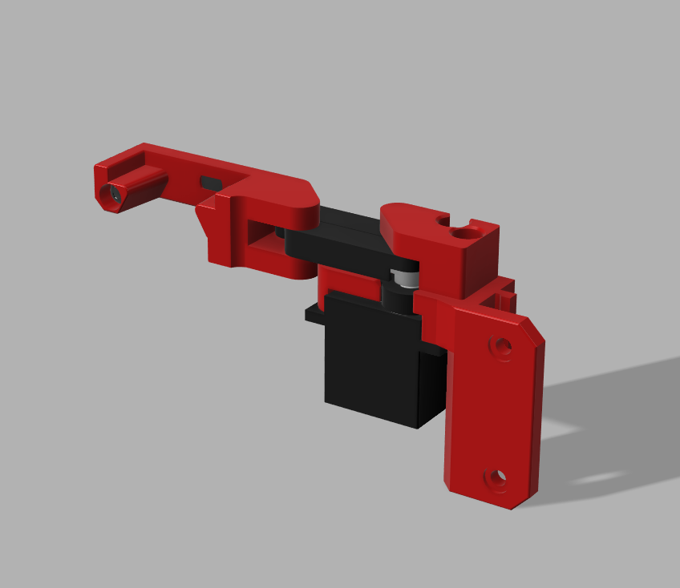

# KlickSwipe - A servo-powered retractable dock for Klicky Probe



KlickSwipe is a alternative mount for the klicky probe derived from the [SlideSwipe](https://github.com/chestwood96/SlideSwipe/) probe, but modified specifically for Klicky.  
It mounts to 1515 extrusion and was designed for use in the V0, but may work in other small printers as well.  
KlickSwipe is particularly useful when your print head can't reach outside of the bed to attach the probe, as it moves the probe within reach only when necessary.


## Bill Of Materials

| Part                              | Qty         | Notes                                   |
| --------------------------------- | ----------- | --------------------------------------- |
| MG90s Servo                       | 1           | SG90 May also work                      |
| M2x8mm Self Tapping Screw         | 2           |                                         | 
| M3x8mm BHCS or SHCS               | 4           |                                         |
| Threaded Insert M3x5x4            | 4           | Standard Voron size                     |
| 4mm OD PTFE Tube                  | 49mm total  | 14mm x 3, 7mm x 1  cutting jig included |
| 6mm x 3mm round neodymium magnets | 1           | Standard Voron size                     |


## Printing

All STL Files are already properly oriented for printing with no supports.  
There are 22mm and 32mm arms provided, only one size is needed, depending on how far your probe needs to reach.


## Configuration
It is necessary to connect and configure the servo motor before you begin the assembly, so that it can be set to it's zero position first.

You may choose to route your wires to the final install location at this time as well.

Connect the servo motor to your controller board.  If your board has a 5-pin `probe` connector, connect the servo wires to +5, GND, and and the servo pin.  The remaining 2 pins may be used by the klicky probe itself.

The diagram below is for the BTT SKR Mini E3 V2.  Reference your controller's documentation for other configurations.


Add the servo to your printer.cfg file 

```
[servo KlickSwipe]
## See: https://www.klipper3d.org/Config_Reference.html#servo
pin: PA1
initial_angle: 0
maximum_servo_angle: 90

```


Add the following macros to your config, *after* including `klicky-macros.cfg`

```
[gcode_macro _DeployDock] # Deploy Arm
description: Deploys the probe dock
gcode:
    SET_SERVO SERVO=KlickSwipe ANGLE=90
    G4 P500

[gcode_macro _RetractDock] # Retract Arm
description: Retracts the probe dock
gcode:
    SET_SERVO SERVO=KlickSwipe ANGLE=0
    SET_SERVO SERVO=KlickSwipe WIDTH=0

```

Restart Klipper, then execute `_DeployDock` followed by `_RetractDock`  you should hear the servo motor turn.  It is now in the zero position, ready for assembly.


## Assembly
 
The animation below shows the basic assembly process.  Take care to attach the servo arm so that it is parallel to the body of the servo, and the probe dock is fully retracted.


## Installation

The Servo mount attaches to 1515 extrusion and can be installed on the front-right extrusion of a V0 as pictured below.


