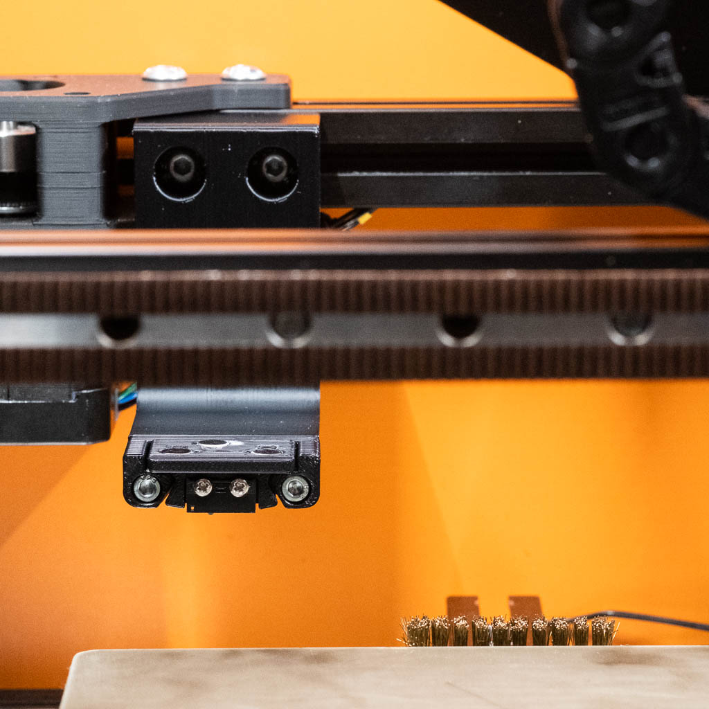
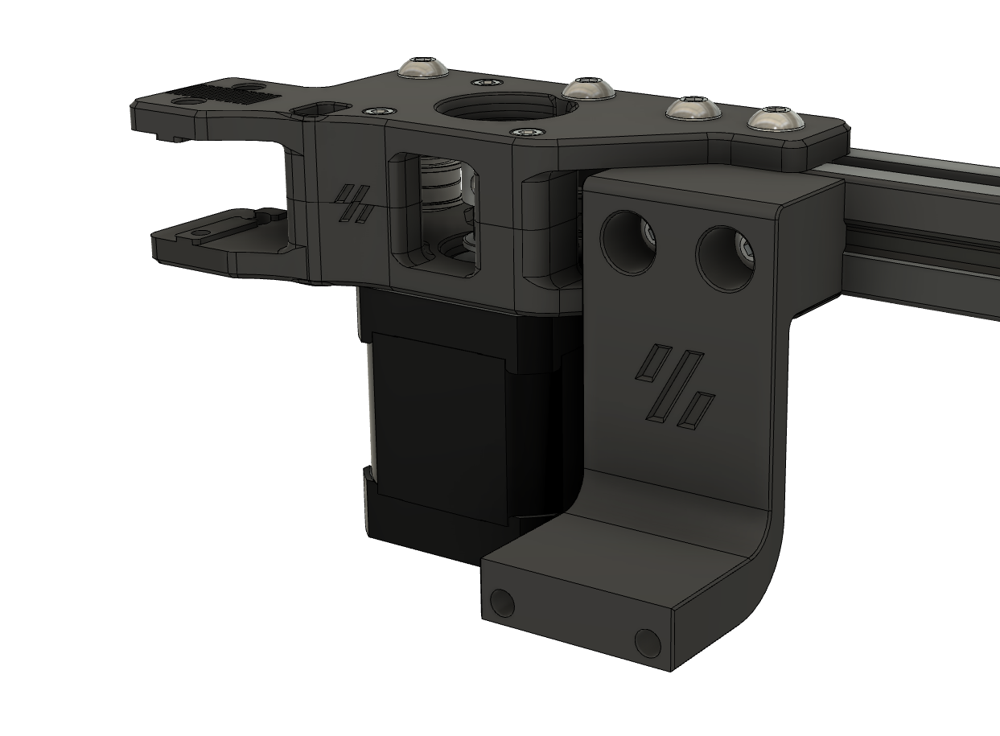
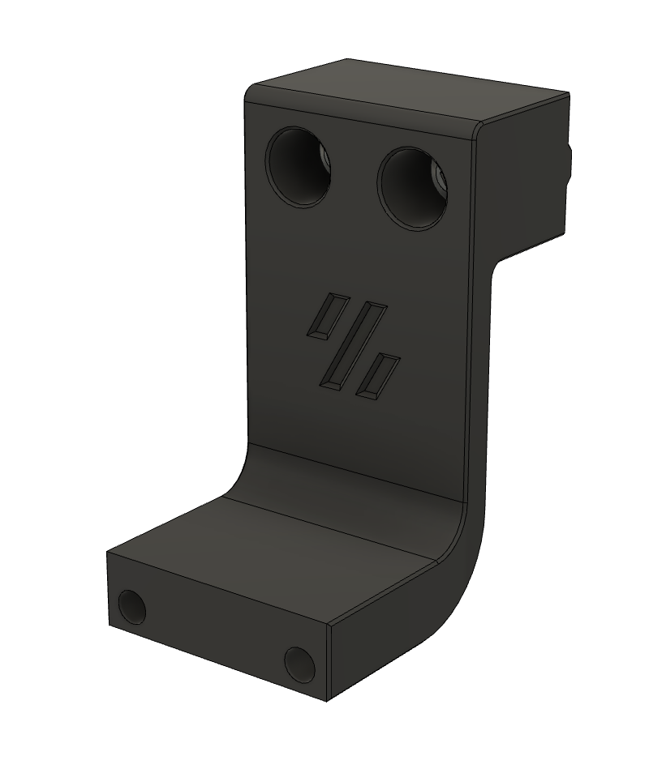
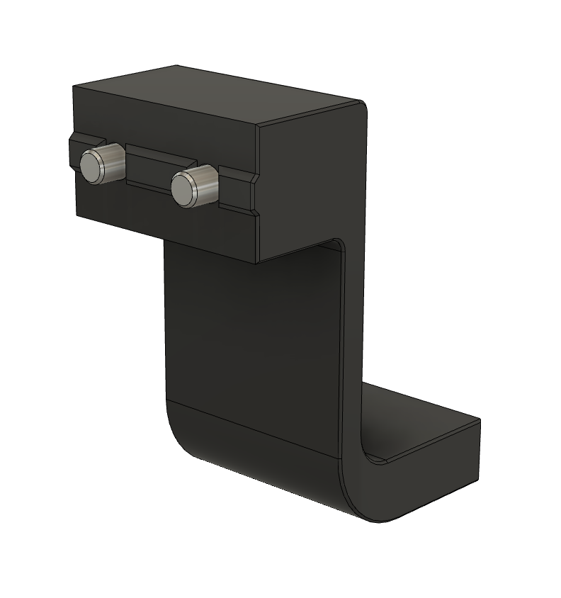

# Dock mount fixed S

A dock mount that can be positioned closer to the end of the V2 or Trident rear gantry extrusion to avoid the nozzle brush, without using a side mount. It also puts the dock 2.5mm forward (i.e. in the negative y direction) which was necessary for my setup.

Tested on a 300mm3 V2.4 with a 2mm extrusion backer on the back of the X extrusion.

## Fasteners
- 2 x M5x16 SHCS or BHCS

Fiction#5826 on Discord
