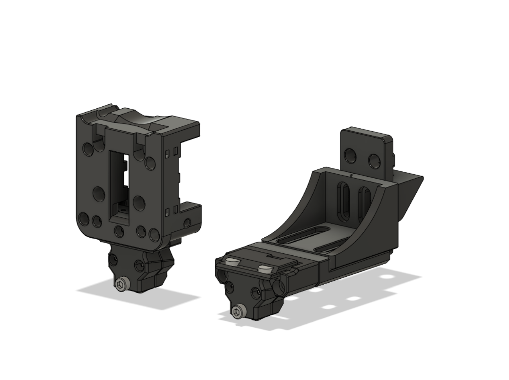
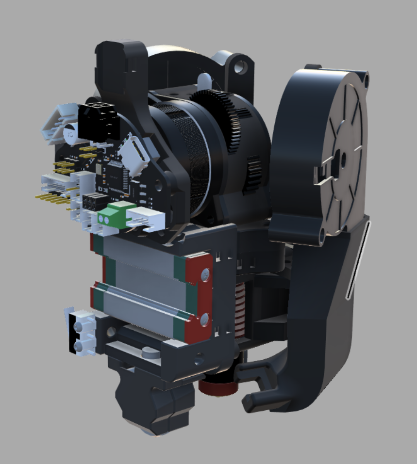

Native KlickyNG (6x3) Xcarriage and fitting Dock

has a cutout in the back to fit kayosmakers fly-sht36 mountings if your using a <20mm stepper

klicky offsets can be kept the same, if youre using autocalibrate-z id recommend to probe on the right next to the pin. 

start with a switch_offset of about 2.5 (ie. im using 2.925)

