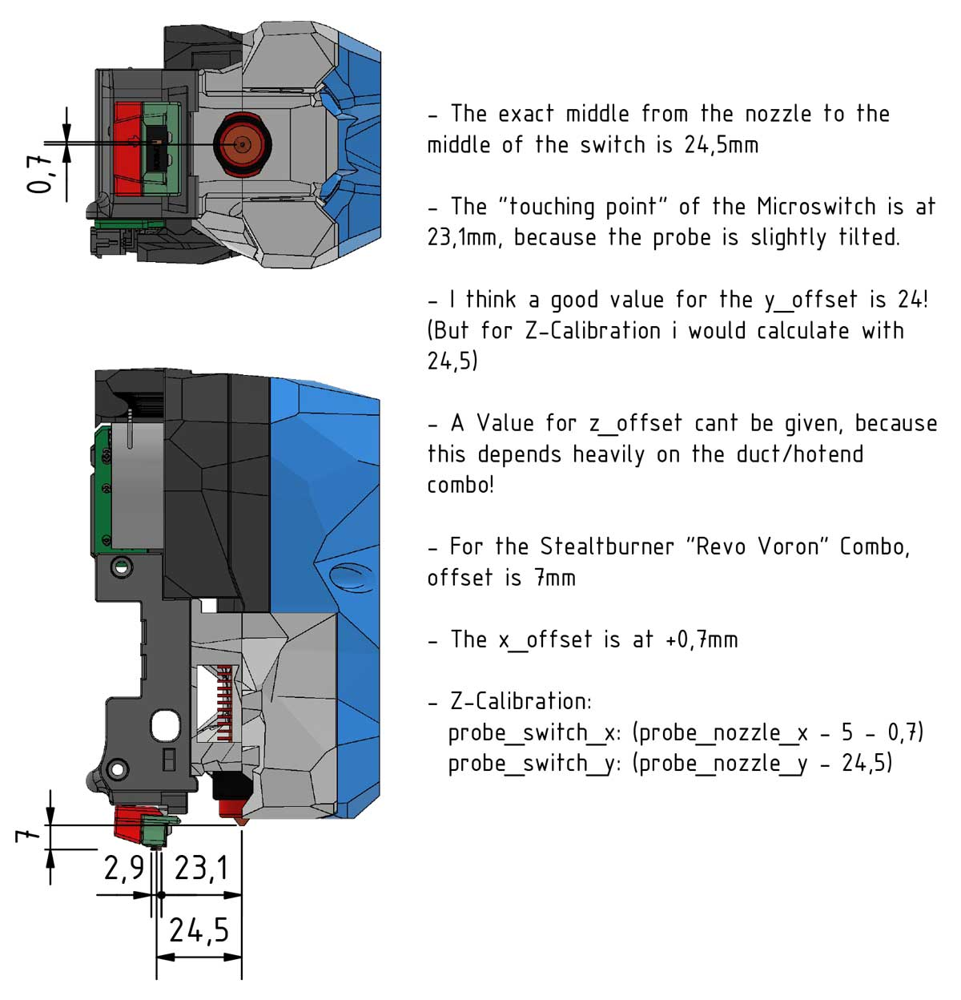

## Integrated KlickyNG Carriage for MGN12

  

    Changelog:
  

- Update (04.07.22): Initial Release / Testing Phase! 

  

    CREDITS: jlas1, Voron-Team & all the great people we have in our community :-)
  

* Voron-Team: Yeah, without you Guys, nothing were possible here :-) 
* jlas1: Basically its his KlickyNG, just merged into the Carriage! Thanks Jose that you made this all possible! 
* Quickdraw & Euclid guys: They came first with a microswitch probe, so thank you for the inspiration! 
* Community: Feelingwise discord is a Place filled with only nice and always helpful People! A special thanks to all of them, i personally just love everyone there! 

  

    Print Settings:
  

- Default Voron settings, correct orientation, no supports needed! 
- 40% Infill, 0,4 line width, 4 walls, 5 top/bottom. But it doesn't matter that much, you can use less infill or 3 walls and 3top/bottom to save weight. 
- I recommend lately to use Cura 5.0 Slicer, just because it has now variable line widths by default, which makes everything easier! 

  

    BOM:
  

- (insert version only) - 2x M3x50/55 SHCS 
- (nut version only) - 2x M3x55/60 SHCS 
- (nut version only) - 2x M3 Nut (Din 934/562/557 or Nut GB/T), anything just not thicker as 2,5mm!
- 3x M2 Self Tapping screws (same as for the probe) 
- 3x (normal 6x3) or (chinese 6x2,7) magnets 
- 2x M5 Washer 
- 2x ~13cm Cable 
- KlickyNG_ABSB_mount_front.stl or KlickyNG_ABSB_mount_3mm_front.stl (jlas1 main repo) 
- Everything else KlickyNG related that isn't carriage. 
- All the screws from your old carriage. 

  

    Notes:
  

You have the choice between "nut" or "insert" and the right side has additionally Endstop Versions! 
On the left side there isn't any endstop, so only the choice between insert or nut! 
The insert versions works with M3x50 or M3x55 
The nut versions with M3x55 or M3x60 

#

