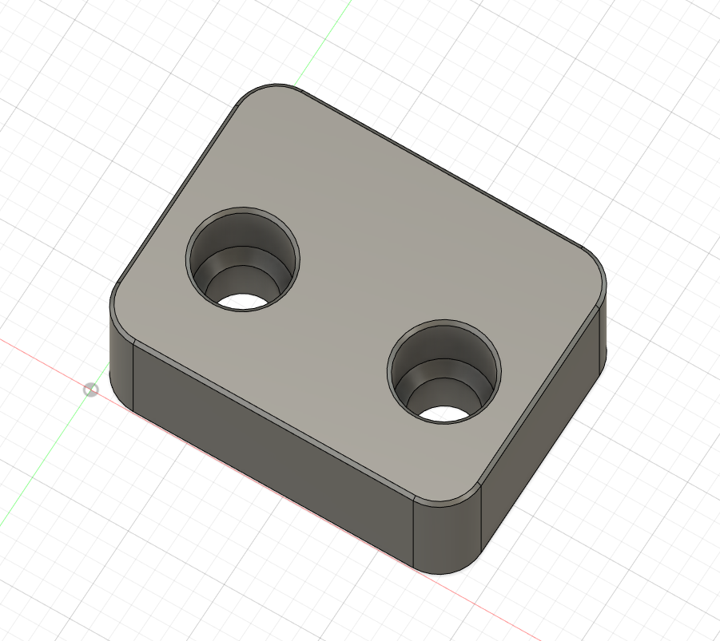

Klicky Probe Bracket for MGN12 X Carriage
=========================================

BOM
---

* 2x M3x5x4mm heatset insert
* 2x M3x16 or M3x20 (or whatever works for you depending on the AB/SB mount you're using)

Print Settings
--------------

* Default Voron settings
* Print as-is

Install
-------
It is recommended to install the probe bracket with the heatset insert face inwards to provide more leverage and support to the probe bracket.
