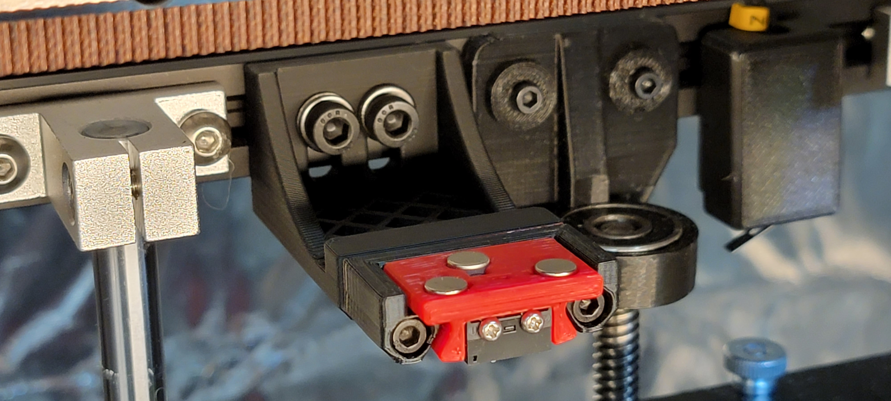
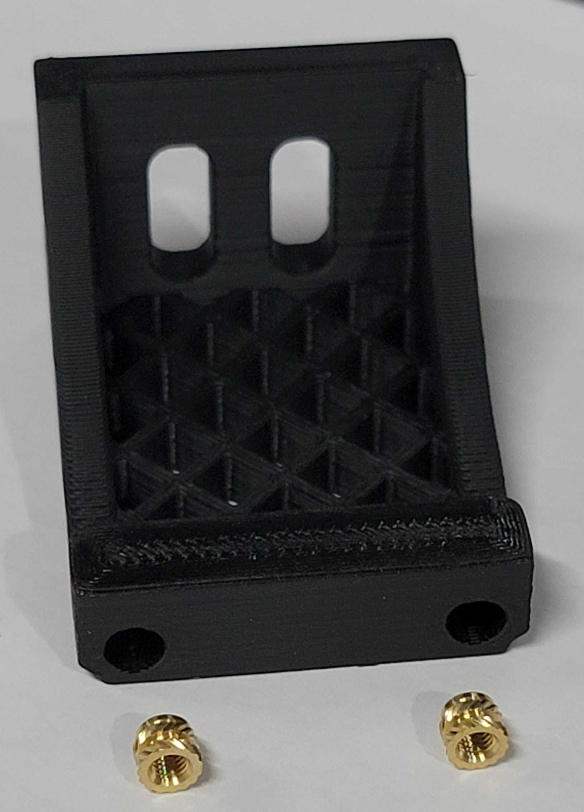

# Klicky Probe for Zero G Mercury One printers
Here you will find the necessary files and documentation to print and setup your own klicky probe on the [Zero G Mercury One](https://github.com/ZeroGDesign/Mercury).

This directory has the STL files properly oriented for printing and community mods for the respective printer, there are [klipper](../../../Klipper_macros) macros and [RRF](../../../RRF_macros) macros in the repository.

The Zero G Mercury is a Voron-inspired 3D printer conversion that turns Creality Ender 5, 5 Pro and 5 Plus machines into high-performance, klipper-based CoreXY printers.  You can find more information about the project at the [Zero G website](https://zerog.one/index.html) or the [Zero G Mercury One github](https://github.com/ZeroGDesign/Mercury), or go check their [discord](https://discord.com/invite/gzJP2s8).

## Mounting options

There are two supported gantry configurations for the Mercury One:
- *EVA*: This is the standard gantry, compatible with toolheads from the [EVA project](https://main.eva-3d.page/) project.
- *Voron Afterburner / Stealthburner*: This gantry supports the same toolheads as the Voron 2.4.

### Sourcing

To get the best experience, please consider purchasing from the trusted list of suppliers bellow.

[trusted suppliers list](./Sourcing.md)

### EVA Probe dock mount

Coming soon...


### Voron Afterburner / Stealthburner Probe dock mount

The probe dock is mounted to the rear extrusion just to the right of the leftmost Z-axis bracket:




> Note: The dock can be mounted slightly outside of the Y-axis build volume to help avoid unintentional probe mounting while printing.  If you want to do this, you will need to adjust your Y endstop (physically) and your `[stepper_y]` `position_max` in `printer.cfg` to make sure the toolhead can reach the probe dock.

### Probe toolhead mount

The probe is mounted to the Afterburner / Stealthburner gantry bracket inside the cavity for the inductive probe. It can be used as a Z-probe for bed mesh leveling and as a Z endstop for perfect first layers on any bed.

### Printed parts
There is no need for supports, all the files are ready to print, they are in the recommended orientation.

The Klicky Probe consists of four different components:

- Toolhead components, found in the [Voron 2.4 STL directory](../../Voron/v1.8_v2.4_Legacy_Trident/v1.8_v2.4_Legacy_Trident_STL/):
    - [`KlickyProbe_AB_mount_v2.stl`](../../Voron/v1.8_v2.4_Legacy_Trident/v1.8_v2.4_Legacy_Trident_STL/KlickyProbe_AB_mount_v2.stl)
    - [`Mount_magnet_holder.stl`](../../Voron/v1.8_v2.4_Legacy_Trident/v1.8_v2.4_Legacy_Trident_STL/Mount_magnet_holder.stl)
    - [`Mount_magnet_pressfit_helper.stl`](../../Voron/v1.8_v2.4_Legacy_Trident/v1.8_v2.4_Legacy_Trident_STL/Mount_magnet_pressfit_helper.stl)
    - [`Mount_pressfit_holder.stl`](../../Voron/v1.8_v2.4_Legacy_Trident/v1.8_v2.4_Legacy_Trident_STL/Mount_pressfit_holder.stl)
- The probe itself, found in the [KlickyProbe directory](../../../Probes/KlickyProbe/STL), [KlickyProbe_v2](../../../../Probes/KlickyProbe/STL/KlickyProbe_v2.stl) 
- Probe dock, found in the [base STL directory](../../../Probes/KlickyProbe/STL/), [Probe_Dock_v2](../../../../Probes/KlickyProbe/STL/Probe_Dock_v2.stl) 
- Frame dock mount from the [Voron_Toolhead_STL](./Voron_Toolhead_STL/) folder ([CAD models](./Voron_Toolhead_CAD/) are also available)

The recommended printing configuration is:

* initial layer height: 0.24
* layer height: 0.2mm
* bottom/top/perimeters: 4
* infill: more than 23%
* infill type: Cubic
* Thin walls: On


## Assembly

### Steps 1 through 4
Follow assembly steps 1 through 4 in the [Voron 2.4 instructions](/../../Voron/v1.8_v2.4_Legacy_Trident#assembly).

Make sure to print and use the dock mount in [Voron_Toolhead_STL](./Voron_Toolhead_STL) and install the heat set inserts:



### Step 5: klipper configuration

Unfortunately, I do not know how to document RRF probe configuration, so here is only Klipper configurations.

As of right now, klipper and RRF have no inbuilt support for a removable probe, fortunately, it does support very robust macro programming, so you will need to add macros to be able to dock and attach the probe as necessary, as well as supporting the rest of the functions that require the usage of a probe.

The macros and instructions on how to configure are located on the [Macro directory](../../../Klipper_macros), you need to **check that before continuing on the build**, there are also some [RRF scripts](../../RRF_macros).

For the printers that are covered here, this is the recommended configuration in `klicky-variables.cfg`:

```python
variable_verbose:               True  # Enable verbose output
variable_travel_speed:          200   # how fast all other travel moves will be performed when running these macros
variable_dock_speed:            50    # how fast should the toolhead move when docking the probe for the final movement
variable_release_speed:         75    # how fast should the toolhead move to release the hold of the magnets after docking
variable_z_drop_speed:          20    # how fast the z will lower when moving to the z location to clear the probe

variable_safe_z:         	    25    # Minimum Z for attach/dock and homing functions
# If true it will move the bed away from the nozzle when Z is not homed

variable_enable_z_hop:          True  # set this to false for beds that fall significantly under gravity (almost to Z max)

# Dock move (the final movement required to reach the dock and avoid the arms with the probe attached)
Variable_dockmove_x:            40    # Final toolhead movement to release
Variable_dockmove_y:            0     # the probe on the dock
Variable_dockmove_z:            0     # (can be negative)

# Attach move (the final movement required release the probe on the dock)
Variable_attachmove_x:          0     # Final toolhead movement to Dock
Variable_attachmove_y:          30    # the probe on the dock
Variable_attachmove_z:          0     # (can be negative)

variable_docklocation_z:      -128    # Z dock position (-128 for a gantry/frame mount)
```

This is an example `printer.cfg` configuration for a BigTreeTech Octopus Pro, with the Klicky probe connected to the `PC5` probe pin, please update it to your specific configuration.  It is recommended to set the probe voltage on the Octopus to `5v` instead of the default `24v`.  Alternatively, you can use a normal endstop pin for the Klicky probe.

```python
[probe]
pin: PC5 # Set the Octopus jumper to 5v instead of the default 24v!
x_offset: -1.5
y_offset: 19.75
z_offset: 7.450
speed: 2.5
samples: 3
samples_result: median
sample_retract_dist: 2.0
samples_tolerance: 0.01
samples_tolerance_retries: 5

[bed_mesh]
speed: 120
horizontal_move_z: 10
mesh_min: 20, 24
mesh_max: 210, 190 # Ender 5 / 5 Pro
#mesh_max: 340, 310 # Ender 5 Plus
probe_count: 5,3
```

I recommend a probing speed between 5mm/s and 10mm/s, you may experiment to see what is the better speed for your machine.
Please confirm that if you are using the probe input, that the pull-up is enable by using the ^ sign, normally the endstop pins have a hardware solution that does not require this configuration.
Depending on your switch you may need to add a `!` to invert that pin (normally open vs. normally closed).
Normally the endstop pins use a hardware solution, so it is not necessary.

There is now an arrow on the probe telling you where should the switch pole be to have the correct offset.

#### Z endstop and Probe configuration

If you want to use the Klicky Probe as your Z endstop (recommended), you need to change the `endstop_pin:` under the `[stepper_z]` section to `probe:z_virtual_endstop`.

Just comment out the old one and add a new line `endstop_pin: probe:z_virtual_endstop` and comment out `position_endstop`:

To use Klicky as a Z-endstop (recommended), you must update `printer.cfg`:
```python
[stepper_z]
endstop_pin: probe:z_virtual_endstop # Klicky probe Z endstop
#position_endstop: -0.10
```

You will need to update the `klicky-variables.cfg` Z probing variables, set the two variables below to `0`, it will probe the middle of the bed.

```python
variable_z_endstop_x:     0
variable_z_endstop_y:     0
```

#### Assembled Klicky Probe


### Step 6: klipper  Dock/Undock configuration

#### Adjust Probe Pickup Position

One of the last things we need to do is to adjust the probe pickup position.

Make sure that the x and y axis are homed and the probe is manually attached to mount, it is easier to do with the hotend and fan duct removed.

Now manually (with gcode commands) move the toolhead to the front of the probe dock, adjust X so that moving along Y does not hit the dock arms, ***note the X-Position***.

Example for a Ymax of `305`:

```gcode
G0 X20 Y270
G0 X20 Y280 (you see that the right side will hit the dock arm)
G0 X20 Y270
G0 X19 Y270
G0 X19 Y280 (still hitting the dock on the right side)
G0 X19 Y270
G0 X18 Y270
G0 X17 Y280 (now does not hit)
```
Your `variable_docklocation_x` is determined to be `17`

Now manually (with gcode commands) move the toolhead to the  X:`variable_docklocation_x`, Y:`max-40` position.
In the example above, it would be `G0 X17 Y265`.

The probe and dock magnet can be 1/2 mm away from each other, that is ok, they will attach when the probe is released from the mount.

Now move the toolhead 40mm to the side and check if the probe is docked securely.
If it does, perfect, variable_docklocation_y is your `Ymax`, if not, you need to either increase the `Ymax` or add a dock extender and repeat the process.

Open your `klicky-variables.cfg` and find the `#dock location` section and edit the following two lines

```python
variable_docklocation_x:
variable_docklocation_y:
```

Test now with the `ATTACH_PROBE` and `DOCK_PROBE` macros to see if it docks and is removed correctly, some common points that can give problems are:

* the dock magnet is touching the back probe magnet, they cannot touch, push them further in
* the probe is hitting the dock arms, please move the toolhead more to the side where the probe does not hit, by 1mm at a time, until it works
* the probe is falling after being release, the dock is too far away, you can insert one or several 1mm spacer to move the dock and solve this

#### Probe_accuracy and Probe_calibrate

> ***WARNING***: when you are doing `PROBE_ACCURACY`, make sure that the probe is above the bed, the `PROBE_ACCURACY` macro does not move the toolhead in X or Y.

## Firsts tests

Before testing klicky, and from past mistakes, please remove your PEI sheet (the probe works on the magnetic sheet) and

If possible, change your printer maximum speed, acceleration and Z current, on klipper with TMC steppers, this is how you do it:

```python
SET_TMC_CURRENT STEPPER=stepper_z CURRENT=0.6
SET_TMC_CURRENT STEPPER=stepper_z1 CURRENT=0.6
SET_TMC_CURRENT STEPPER=stepper_z2 CURRENT=0.6
SET_TMC_CURRENT STEPPER=stepper_z3 CURRENT=0.6
SET_VELOCITY_LIMIT ACCEL=1000
SET_VELOCITY_LIMIT VELOCITY=100
```

Enjoy your Klicky Probe!

## Dock, undock and Z-endstop probing video
This video shows the docking, undocking and z-endstop probing process in a Zero G Mercury One

[](https://www.youtube.com/watch?v=HXm9AFOVeQQ)

It is working very well, if you decide to use it, give me feedback, either here, or on discord, my discord user is srkthain#6222.

By standing on the shoulders of giants, lets see if we can see further.
