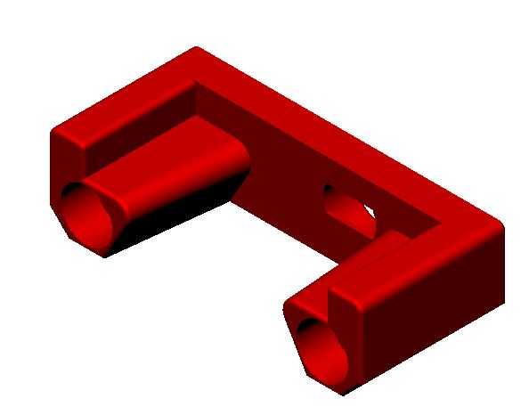
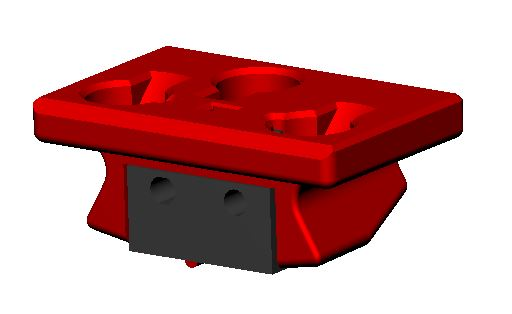

# Klicky Probe
Microswitch probe with magnetic attachment, primarily aimed at CoreXY 3d printers.

The objectives for this project are:

- drop in replacement for Omron TL-Q5MC2 or PL-08N2 (you don't need to replace the toolhead), replacement of BLtouch probes
- no soldering required
- minimal adjustments required
- be able to detect all the print surfaces
- be as close to the hotend tip as possible
- highly repeatable and accurate probes
- less temperature variations
- no melting of its parts
- reuse spare parts if possible
- no need to use hard to source parts

## Print Settings

There is no need for supports; recommended settings are 4 perimeters/top/bottom, at least 23% infill. The STL's are already oriented for you, so you only need to send them to the slicer.

## Required parts

|  | Klicky dock, it secures the probe to the dock via an extra magnet. Allows to pull the probe by at least 2mm away |
| :----------------------------------------------------------: | ------------------------------------------------------------ |
|  | Probe body, there are 4 probe body's: KlickyProbe v2, in the image, classical klicky probe Long version, to be used on small printers, can reach under the nozzle to increase probe area Longer version, to be used on small printers, can reach under the nozzle to increase even more probe area XL version, classical probe extended by 12 mm useful for UHF hotends |

The required files are located here:

- [CAD files](../../CAD)
- [STL files](./STL)

# Bill of Materials (BOM)

- 1x microswitch (the Omron D2F-5, or D2F-5L with the lever removed, are recommended, but similar-sized microswitches like D2F-1 and KW10 will also work)
- 30cm of wire, AWG22 or similar
- 2 M2x10mm self-tapping screws
- 5x 6mm diameter x 3mm height magnets
- 2x M3x18mm/M3x20mm screws

# Build Process

## Probe assembly

For the probe assembly you need the following parts:

- [ ] 1x microswitch
- [ ] 2x M2x10 mm self tapping
- [ ] 4x 6 mm x 3 mm magnets
- [ ] 1.5mm Drill (optional)
- [ ] Multimeter to check for Continuity 
- [ ] Super Glue

Maybe you need to clear the holes for the microswitch, a 1.5mm drill bit should work fine.

Install the microswitch so that the arrow on the probe body is pointing to the little switch.

Then take your self tapping screws and screw the microswitch in place.

**Notice, there is an alternative method to install the magnets, that seems to improve fitting and results please read the instruction until the end and then decide on what is the bet method for you,**

Before placing the magnets, use some super glue on the holes (not a lot, just a drop), avoid the switch parts.

You want to install the magnets in the way that the ones which are connected to the microswitch, have the same polarity  The 3rd magnet should have the inverse polarity, you can use the included pressfit helpers to help in securing the probe when you are inserting the magnets.

There is no need for soldering, the probe microswitch connectors are press-fit on the magnets, they should remain with the top above the probe plastic.

Don't forget to install the magnet which holds the probe to the probe dock, make sure it is fully inserted.

As the last step of the probe assembly check if you have continuity between these two magnets

If you have a normally closed switch (as you should), then you should have a current flow, so continuity is established. When you press the switch you should lose continuity. When you have a normally open switch then the behavior is the other way around.

### Alternative installation method (by [kyleisah](https://github.com/kyleisah) and [DrachenKatze](https://github.com/DrachenKatze)  (who came up with the idea)

- Insert switch into probe and install screws
- Install stripped wire leads into probe mount
- Apply dabs of glue to probe, and quarter-install 2 magnets into each hole, making sure to invert the polarity for the rear probe magnet hole
- Apply dabs of glue to the probe mount and line up the magnets from  the probe to the magnet holes of the mount and press them in best you  can so they stay in the holes
- Using the press fit tools, force the probe and mount together so they bottom out against each other.
- Do not pull the probe and mount apart, slide them apart and allow the glue to cure.
- After the glue has sufficiently cured (read the label) slide the  mount and probe back together so the magnets realign and check for  continuity at the ends of the probe leads.

## AB/SB Mount

If you are going to use a AB/SB mount, please proceed to it's [instruction here](./ABSB_mount.md), otherwise proceed with the setup instructions of your printer.

## Final thoughts

For the installation, you should now install the dock (according with your printer instructions) and mount the probe mount.

It is working very well for me. If you decide to use it, please send me feedback, either here, or on Voron discord. My discord username is `@JosAr#0517`.

By standing on the shoulders of giants, let's see if we can see further.
