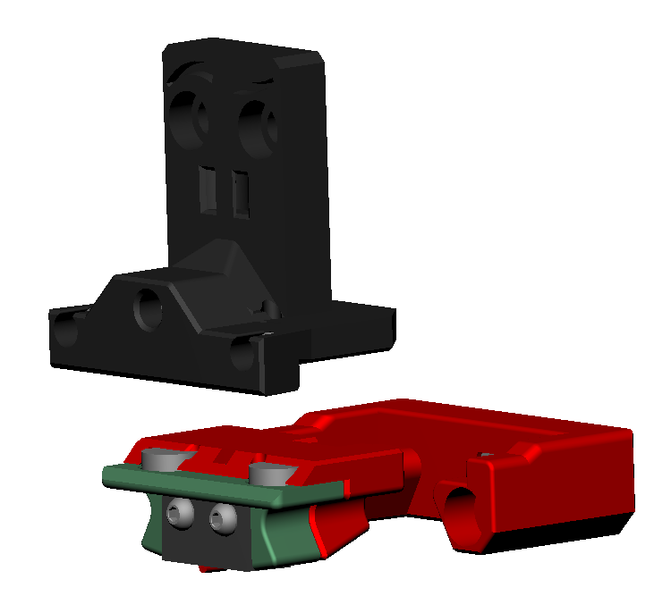

# Probe options

Right now, there are two probe attachment options, each with two probe types.

## Regular Klicky

First klicky probe, based on the [Quickdraw probe](https://github.com/Annex-Engineering/Quickdraw_Probe), with an added third magnet for added stability and fixed dock gantry setups.

It uses magnets to secure the probe to the mount and also to make the electrical connection.
The magnets can be glued to prevent them from coming loose.
It supports a [microswitch probe](./KlickyProbe/) and [Unklicky](./KlickyProbe/) ([invented by DustinSpeed](https://github.com/majarspeed/Unklicky)) (self built probe, that so far surpasses the microswitches in common use) based probing.

#### [Assembly instruction](./KlickyProbe/)

## KlickyNG

New enclosed magnets probe, it does not require glue to help prevent the magnets from coming loose, magnets are also self aligning.
This approach only uses common and easy to source parts.

Also supports [microswitch probe](./KlickyNG/) and [Unklicky](./UnklickyNG/) ([invented by DustinSpeed](https://github.com/majarspeed/Unklicky)) (self built probe, that so far surpasses the microswitches in common use) based probing.

#### [Assembly instruction](./KlickyNG/)
