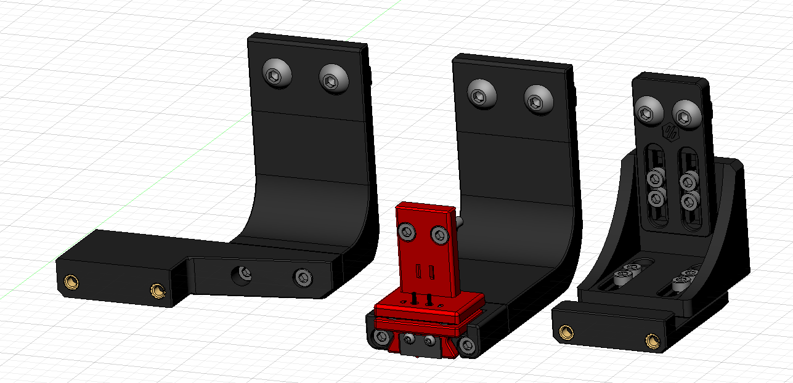

# Klicky-Probe
Microswitch probe with magnetic attachement, primarily aimed at CoreXY 3d printers with a focus on the Voron v2.4.
It replaces the standard inductive sensors using microswitches and magnets.

The inspiration for the Klicky Probe comes from the  and the , it uses some concepts from each of the projects.

There are no need for supports, recommended settings are 4 perimeters/top/bottom, 13% infill.

The probe dock is mounted on the gantry, allowing it to be use as a Z endstop if desired (i use it that way).

There are two gantry extrusion mounts possible:
- one fixed to be used on the AB with MGN12 or MGN9
- one that has some variance for other toolheads.

It is not necessary any soldering, the AB mount wires are connected with pressure from the magnets and the probe microswitch connectors are also press-fit on the magnets.

  
   

The magnet recommended installation is that the two magnets that attach to the microswitch are installed with the same polarity, the 3rd magnet should have the inverse polarity.
It is also recommended to glue the magnets in place, superglue is good.

You will need to add macros to klipper to be able to dock and undock the probe as necessary to do the Endstop (if necessary) and Quad Gantry Level, it is in the Klipper Macro directory.

Probe BOM:
- 1x microswitch (like the omron D2F)
- 4x 6x3 magnets

AB mount BOM:
- 3x 6x3 magnets

Probe Dock:
- 1x 6x3 magnets
- 2x M3x20

Fixed Dock mount:
- 2x M3 threaded insert M3x5x4
- 2x M5x10
- 2x M5 t-nut or equivalent

or 

variable Dock mount:
- 10x M3 threaded insert M3x5x4
- 8x M3x8
- 2x M5x10
- 2x M5 t-nut or equivalent

I will add more detail to this repository as we go along.

The macro is based on a version provided by the user garrettwp on Discord, many thanks to him.
I have tweaked it a bit.
It is also originally  based on the great Annex magnet dockable probe macros "#Originally developed by Mental, modified for better use on K-series printers by RyanG and Trails" and can be found 

Would also like to thank the Voron discord community and VoronDesign for all the work that was and still is being made to maintain the Voron ecosystem.

The probe accuracy output is something like this:
probe accuracy results: maximum 6.430000, minimum 6.426250, range 0.003750, average 6.428750, median 6.428750, standard deviation 0.000791

It is working very well, if you decide to use it, give me feedback, either here, or on discord, my discord user is JosAr#0517.

By standing on the shoulders of giants, lets see if we can see further.
