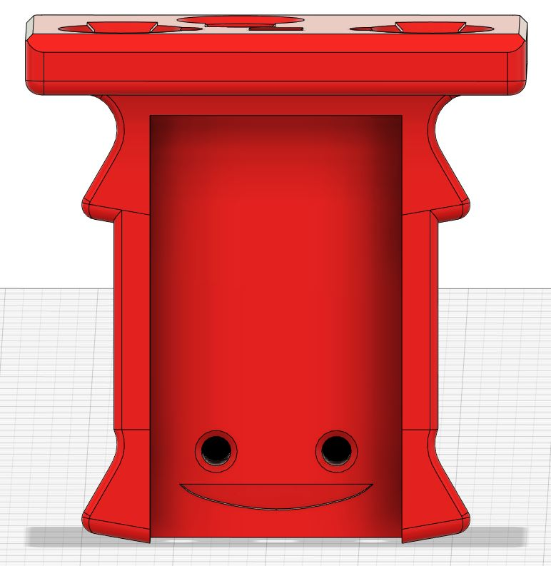
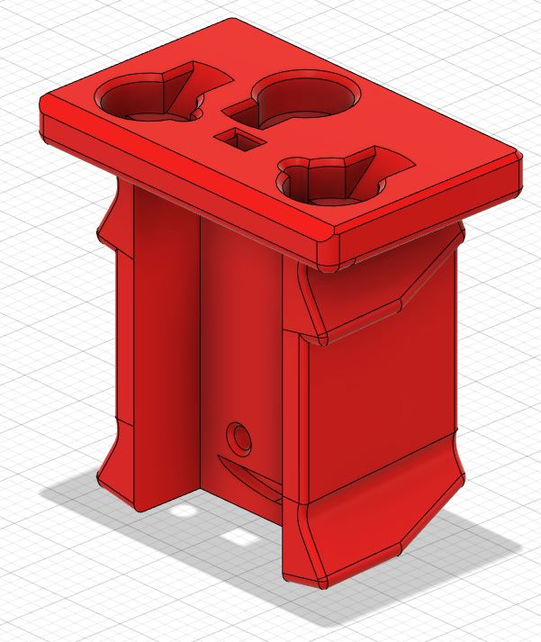
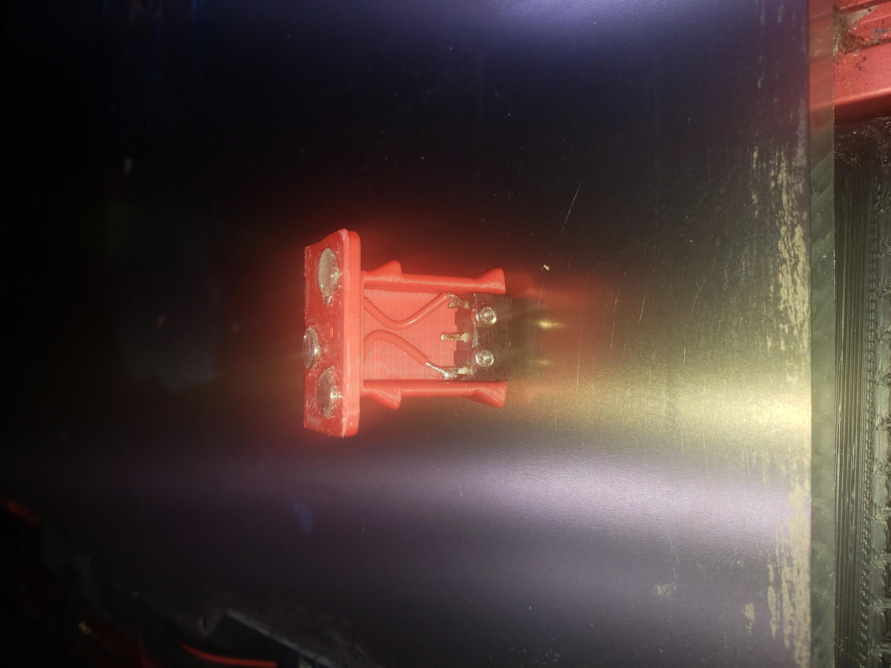

## SemperDiscere's Klicky Probe for the Phaetus DragonUHF with Standard Dragon Mount

> Created by: [SemperDiscere](https://github.com/SemperDiscere)

## Description
This is a modification of Klicky probe to be used with a Dragon UHF (Ultra High Flow) with the UHF Extesion on a standard Dragon Mount.  It's only Klicky (no NG or UnKlicky planned, feel free to expand).  The Dragon UHF (57mm) is 17mm longer (without nozzles) than the DragonSF/HF (40mm). The Probe point is dropped 17mm to accomodate the Volcano style heater and UHF extension.

## Build
Build Is Similar to the AB Mount. 
- Solder wires to the outside pins of the D5F-L switch
- Remove Lever from switch
- Estimate wire length and cut
- Strip Wires
- Feed wires through Holes
- Seat Magnets
- Test continuity
- Trim wires
- Screw switch to Main Body

## Source Klicky probe file
[Klicky Probe](../../CAD/KlickyProbe_v2_v59.step)

## Changelog
v0 23/08/2022 SemperDiscere's Dragon UHF Probe Initital

## Model:
| No | Name                                               | Printable |
| -- | -------------------------------------------------- | --------- |
| 1  | Dragon UHF Probe STL    | [Yes](../stl/Klicky_Probe_Dragon_UHF v0.stl) |
| 1  | Dragon UHF Probe 3MF | [Yes](../stl/Klicky_Probe_Dragon_UHF v0.3mf) |

## CAD formats:
| No | Name                                               | Printable |
| -- | -------------------------------------------------- | --------- |
| 1  | Dragon UHF Probe F3D    | [Yes](../cad/Klicky_Probe_Dragon_UHF v0.f3d) |
| 1  | Dragon UHF Probe STEP | [Yes](../cad/Klicky_Probe_Dragon_UHF v0.step) |

## BOM:
| Qty | Name                                                    | Observations |
| --- | ------------------------------------------------------- | ------------ |
| 4 | 6x3 Magnets | Neodymium preferred |
| 2 | M2 10mm | carpentry type |
| 2 | 5cm 24 ga wire | FEP or PTFE preferred |
| 1 | Omron D2F-5 switch | remove lever if present |

## Hardware Required 
Voron (or printer that uses a voron probe) + Standard Dragon Mount + Dragon UHF Hotend

## To Do 
better pictures
